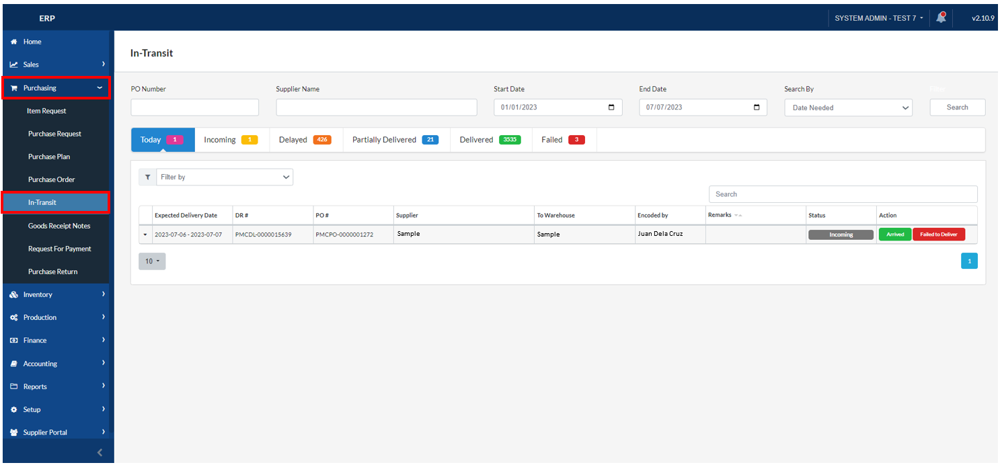
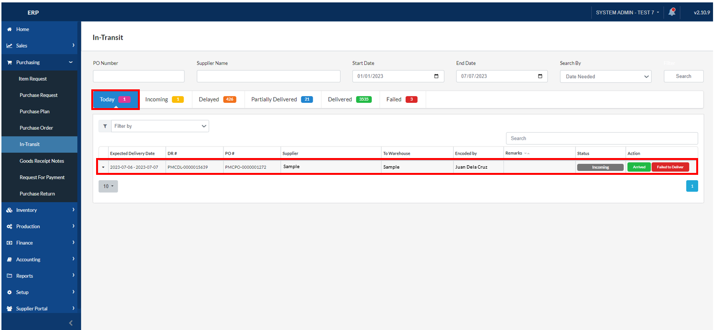
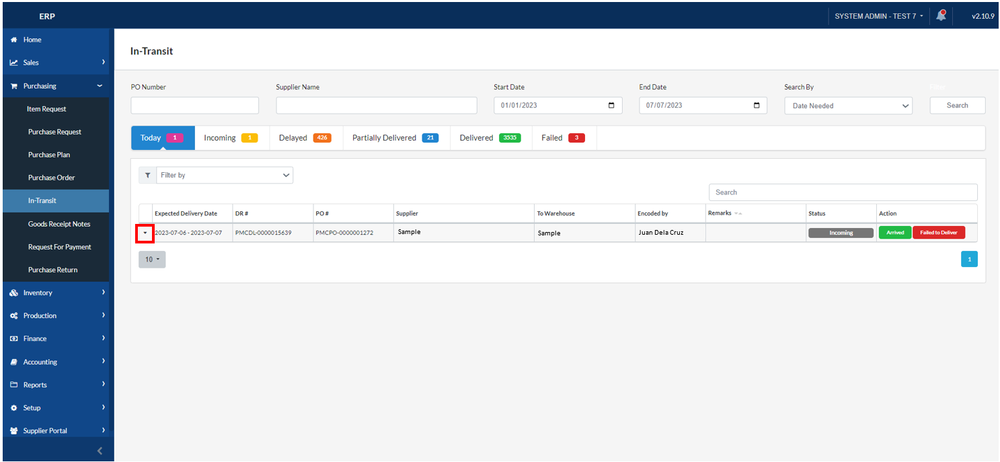
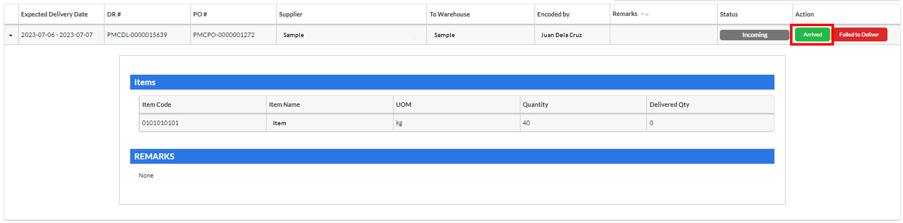
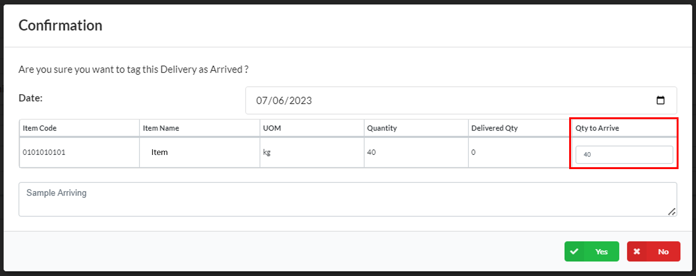
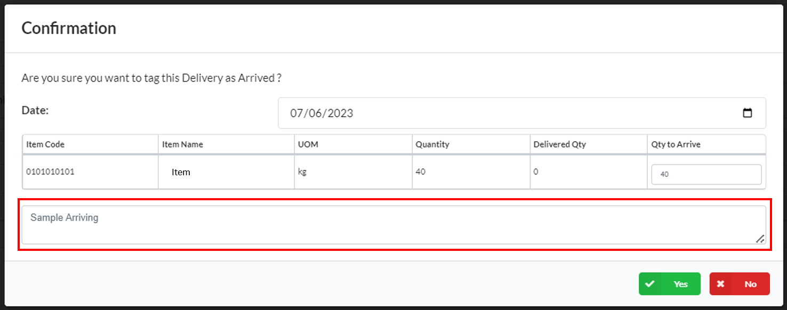
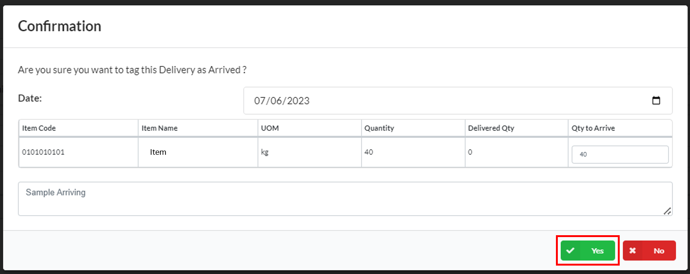
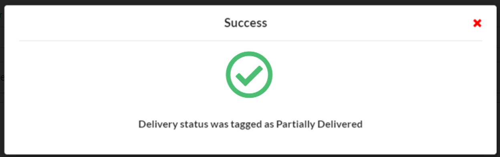
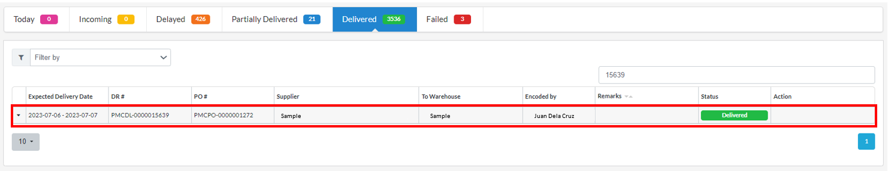

## Arriving Delivery

### Overview

This section provides a step-by-step guide on how to handle the arrival of a delivery. By following these instructions, you will be able to navigate the process of verifying the delivery details and marking it as arrived.

### Step 1: Navigate to the Page

To navigate to the **In-Transit Page**:

&nbsp;&nbsp;&nbsp;&nbsp;&nbsp;&nbsp;&nbsp;&nbsp;&nbsp;&nbsp;&nbsp;**➥** Click on the **`Purchasing`** dropdown button.

&nbsp;&nbsp;&nbsp;&nbsp;&nbsp;&nbsp;&nbsp;&nbsp;&nbsp;&nbsp;&nbsp;**➥** Select **`In-Transit`**.

### Step 2: Locating the Delivery

&nbsp;&nbsp;&nbsp;&nbsp;&nbsp;&nbsp;&nbsp;&nbsp;&nbsp;&nbsp;&nbsp;**➥** After the shipping advice, you can search for the delivery by inputting the **Purchase Order (PO) Number** or locate the delivery that you created. It is usually displayed at the top as the latest transaction or under the **"Today"** tab.

&nbsp;&nbsp;&nbsp;&nbsp;&nbsp;&nbsp;&nbsp;&nbsp;&nbsp;&nbsp;&nbsp;**➥** Click on the **`Arrow`** button (down) to expand the Delivery details. 

### Step 3: Arrive Delivery

&nbsp;&nbsp;&nbsp;&nbsp;&nbsp;&nbsp;&nbsp;&nbsp;&nbsp;&nbsp;&nbsp;**➥** Verify that the **`Details`** are correct. Click on the **`Arrive`** button. 

&nbsp;&nbsp;&nbsp;&nbsp;&nbsp;&nbsp;&nbsp;&nbsp;&nbsp;&nbsp;&nbsp;**➥** A modal will appear as a confirmation of the arrival. Set the **Date** and input the **Quantity** that has arrived.

&nbsp;&nbsp;&nbsp;&nbsp;&nbsp;&nbsp;&nbsp;&nbsp;&nbsp;&nbsp;&nbsp;**➥** Input any **`Arrive`** remarks.

&nbsp;&nbsp;&nbsp;&nbsp;&nbsp;&nbsp;&nbsp;&nbsp;&nbsp;&nbsp;&nbsp;**➥** Click on the **`Yes`** button to confirm.

:::info

A message will be displayed indicating that the status of the delivery has been updated to **Delivered**.

:::

### Step 4: Delivered Order

&nbsp;&nbsp;&nbsp;&nbsp;&nbsp;&nbsp;&nbsp;&nbsp;&nbsp;&nbsp;&nbsp;**➥** The **Delivered Order** is displayed under the **"Delivered"** tab.

:::tip SUCCESS

Congratulations! You have successfully arrived a **Delivery**. 

:::