## Adding Purchase Request

### Overview

This section will walk you through the process of creating a purchase request. A purchase request is used to request the purchase of items or supplies.

### Step 1: Navigate to the Page

To navigate to the **Purchase Request Page**:

&nbsp;&nbsp;&nbsp;&nbsp;&nbsp;&nbsp;&nbsp;&nbsp;&nbsp;&nbsp;&nbsp;**➥** Click on the **`Purchasing`** dropdown button.

&nbsp;&nbsp;&nbsp;&nbsp;&nbsp;&nbsp;&nbsp;&nbsp;&nbsp;&nbsp;&nbsp;**➥** Select **`Purchase Request`**.

### Step 2: Adding an Item Request

To begin with adding an **Purchase Request**:

&nbsp;&nbsp;&nbsp;&nbsp;&nbsp;&nbsp;&nbsp;&nbsp;&nbsp;&nbsp;&nbsp;**➥** Click on the **`Add Purchase Request`** button.

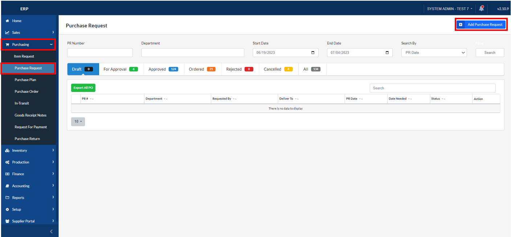

### Step 3: Input the necessary Item Information

&nbsp;&nbsp;&nbsp;&nbsp;&nbsp;&nbsp;&nbsp;&nbsp;&nbsp;&nbsp;&nbsp;**➥** Choose the **`Department`**from the dropdown.

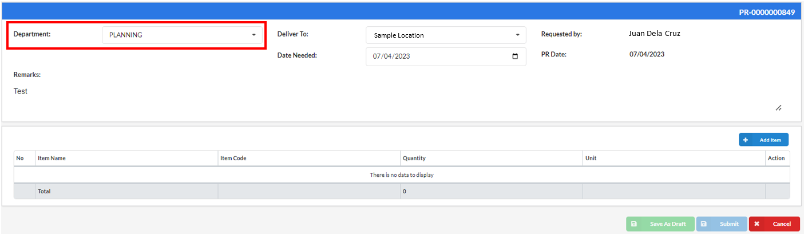

&nbsp;&nbsp;&nbsp;&nbsp;&nbsp;&nbsp;&nbsp;&nbsp;&nbsp;&nbsp;&nbsp;**➥** Choose the **`Destination`**.

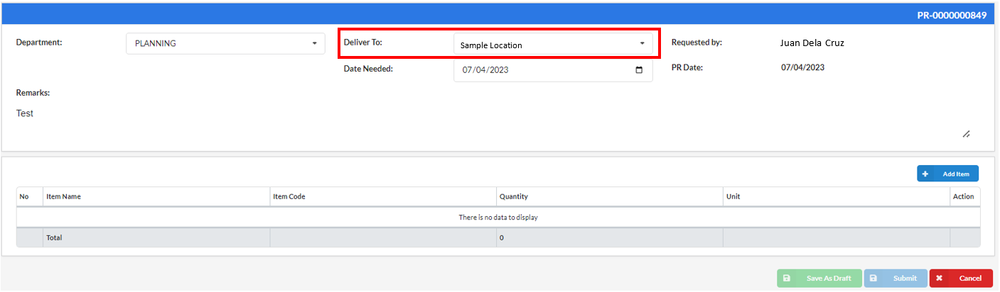

&nbsp;&nbsp;&nbsp;&nbsp;&nbsp;&nbsp;&nbsp;&nbsp;&nbsp;&nbsp;&nbsp;**➥** Choose the **`Date`** when the purchase is needed.

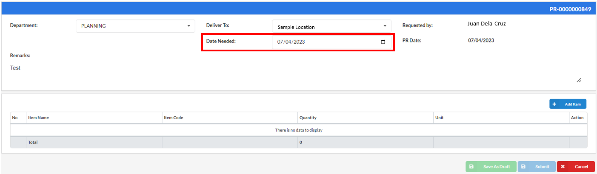

&nbsp;&nbsp;&nbsp;&nbsp;&nbsp;&nbsp;&nbsp;&nbsp;&nbsp;&nbsp;&nbsp;**➥** Input any **`Remarks`**.

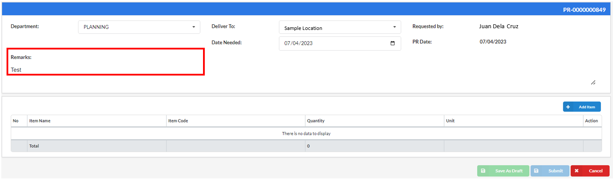

&nbsp;&nbsp;&nbsp;&nbsp;&nbsp;&nbsp;&nbsp;&nbsp;&nbsp;&nbsp;&nbsp;**➥** The **`requester's name`** and the **`PR Date`** will be displayed in the right section.

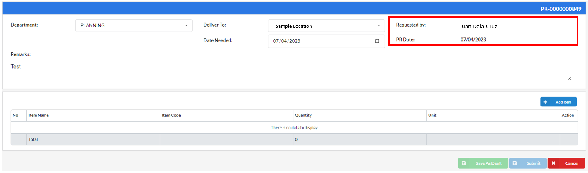

### Step 4: Add Items

&nbsp;&nbsp;&nbsp;&nbsp;&nbsp;&nbsp;&nbsp;&nbsp;&nbsp;&nbsp;&nbsp;**➥** Click on the **`Add Item`** button.

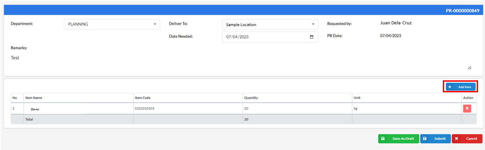

&nbsp;&nbsp;&nbsp;&nbsp;&nbsp;&nbsp;&nbsp;&nbsp;&nbsp;&nbsp;&nbsp;**➥** A modal will appear. Click on the **`Add Item`** button.

&nbsp;&nbsp;&nbsp;&nbsp;&nbsp;&nbsp;&nbsp;&nbsp;&nbsp;&nbsp;&nbsp;**➥** Use the **`Search bar`** to find the item by its **`Name`** or **`Code`**.

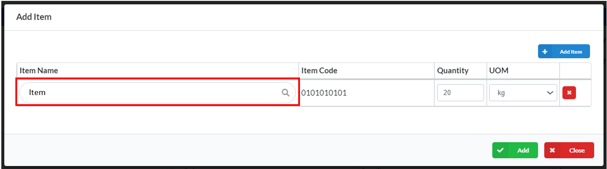

&nbsp;&nbsp;&nbsp;&nbsp;&nbsp;&nbsp;&nbsp;&nbsp;&nbsp;&nbsp;&nbsp;**➥** Input the **`Quantity`**.

&nbsp;&nbsp;&nbsp;&nbsp;&nbsp;&nbsp;&nbsp;&nbsp;&nbsp;&nbsp;&nbsp;**➥** Select the **`Unit`**.

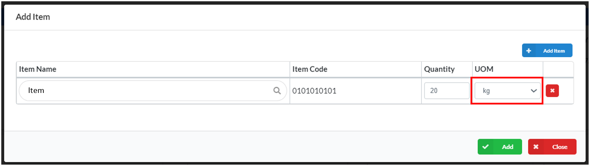

&nbsp;&nbsp;&nbsp;&nbsp;&nbsp;&nbsp;&nbsp;&nbsp;&nbsp;&nbsp;&nbsp;**➥** Click the **`Add`** button to add the item.

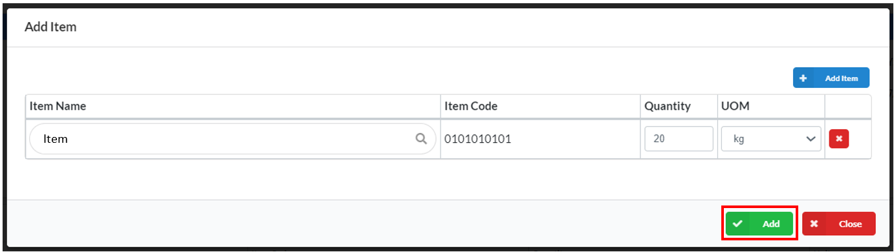

:::info

A message will be displayed indicating that the item was added **Successfully**.

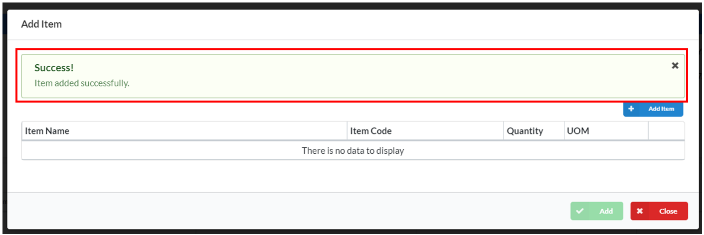

:::

&nbsp;&nbsp;&nbsp;&nbsp;&nbsp;&nbsp;&nbsp;&nbsp;&nbsp;&nbsp;&nbsp;**➥** Click the **`Close`** button to to close the modal.

### Step 5: Save the Purchase Request

Once you have reviewed and confirmed that all the required information has been entered, you can now save it.

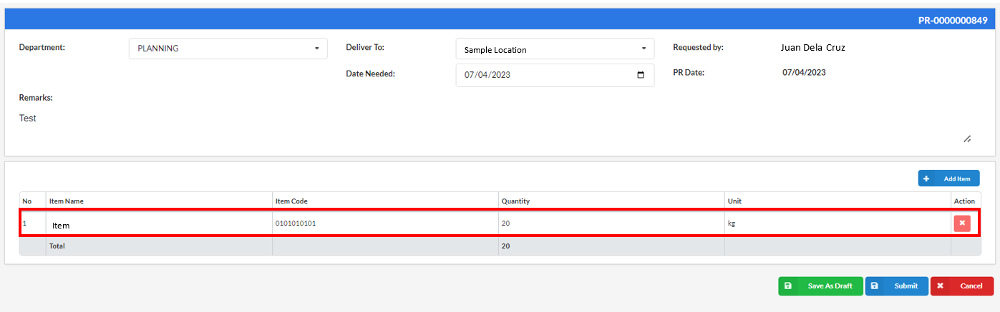

&nbsp;&nbsp;&nbsp;&nbsp;&nbsp;&nbsp;&nbsp;&nbsp;&nbsp;&nbsp;&nbsp;**➥** Click on the **`Submit`** button to complete the process.

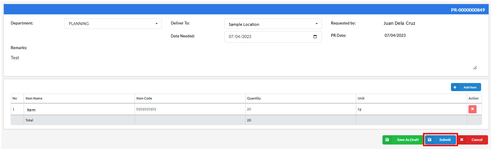

&nbsp;&nbsp;&nbsp;&nbsp;&nbsp;&nbsp;&nbsp;&nbsp;&nbsp;&nbsp;&nbsp;**➥** A confirmation will appear. Click on the **`Yes`** button to confirm the submission.

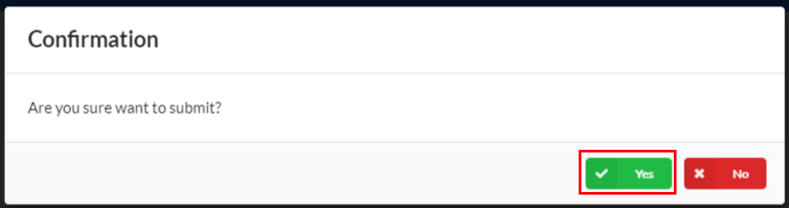

&nbsp;&nbsp;&nbsp;&nbsp;&nbsp;&nbsp;&nbsp;&nbsp;&nbsp;&nbsp;&nbsp;**➥** A message will appear indicating the successful creation of the **`Purchase Request`**.

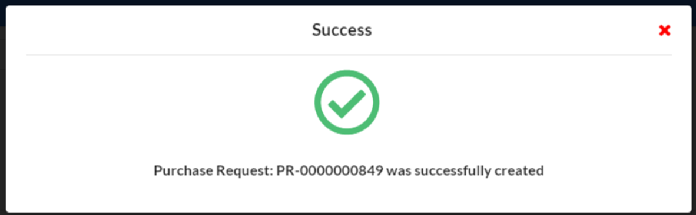

:::caution REMEMBER

Take note of this **Purchase Request number** as your reference. It is located on the upper right corner.

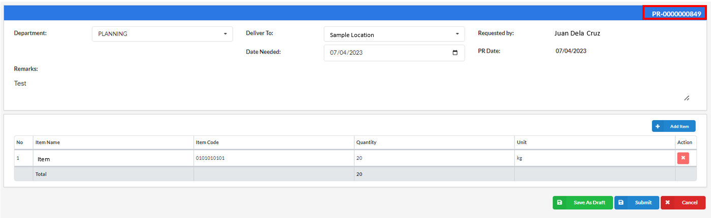

:::

:::tip SUCCESS

Congratulations! You have successfully made a **Purchase Request**. 

:::

