## Approve Purchase Order

### Overview

This section serves as a comprehensive guide on how to approve a purchase order. By following these step-by-step instructions, approvers will be able to navigate the approval process and review the purchase order details.

### Step 1: Navigate to the Page

To navigate to the **Purchase Order Page**:

&nbsp;&nbsp;&nbsp;&nbsp;&nbsp;&nbsp;&nbsp;&nbsp;&nbsp;&nbsp;&nbsp;**➥** Click on the **`Purchasing`** dropdown button.

&nbsp;&nbsp;&nbsp;&nbsp;&nbsp;&nbsp;&nbsp;&nbsp;&nbsp;&nbsp;&nbsp;**➥** Select **`Purchase Order`**.

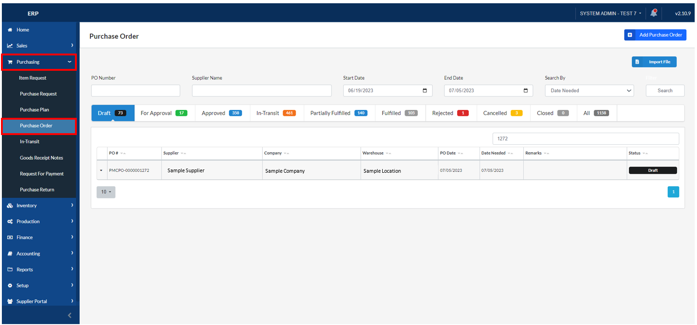

### Step 2: Locating the Purchase Order

&nbsp;&nbsp;&nbsp;&nbsp;&nbsp;&nbsp;&nbsp;&nbsp;&nbsp;&nbsp;&nbsp;**➥** Locate the **Purchase Order** that you created. It usually appears at the top as the latest transaction.

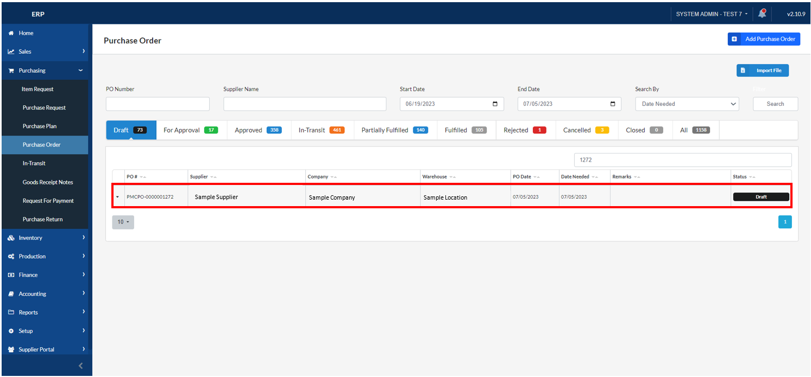

&nbsp;&nbsp;&nbsp;&nbsp;&nbsp;&nbsp;&nbsp;&nbsp;&nbsp;&nbsp;&nbsp;**➥** Click on the **`Arrow`** button (down) to expand the purchase order details. 

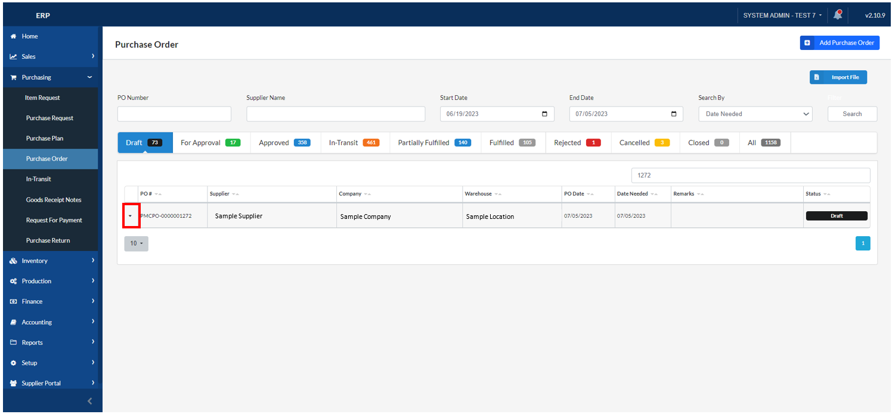

&nbsp;&nbsp;&nbsp;&nbsp;&nbsp;&nbsp;&nbsp;&nbsp;&nbsp;&nbsp;&nbsp;**➥** Verify that the **`Details`** are correct, such as the **Billing Information** and **Order Information**.

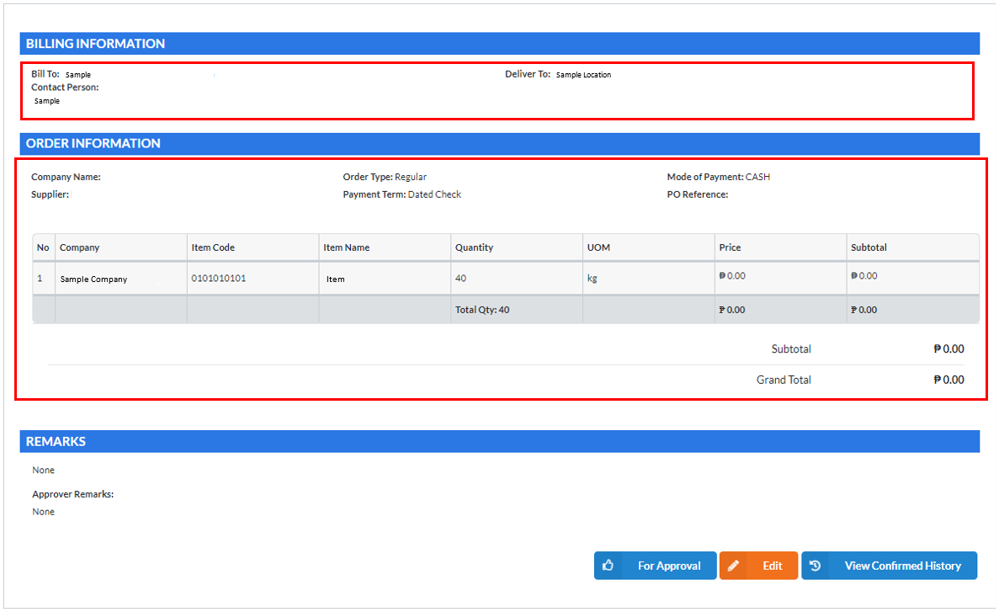

### Step 3: Moving Purchase Order to "For Approval"

&nbsp;&nbsp;&nbsp;&nbsp;&nbsp;&nbsp;&nbsp;&nbsp;&nbsp;&nbsp;&nbsp;**➥** If all the information is correct, click the **`For Approval`** button.

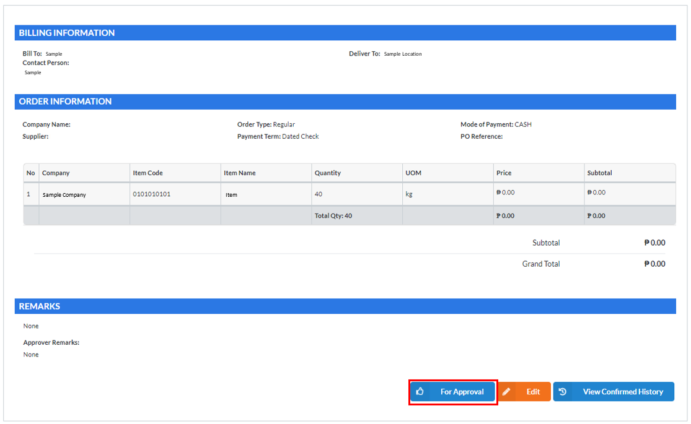

&nbsp;&nbsp;&nbsp;&nbsp;&nbsp;&nbsp;&nbsp;&nbsp;&nbsp;&nbsp;&nbsp;**➥** Provide any **Remarks** related to the Purchase Request.

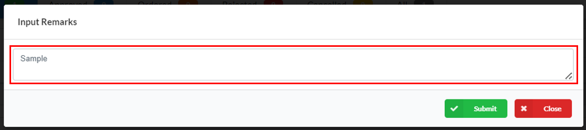

&nbsp;&nbsp;&nbsp;&nbsp;&nbsp;&nbsp;&nbsp;&nbsp;&nbsp;&nbsp;&nbsp;**➥** Click on **`Submit`** button.

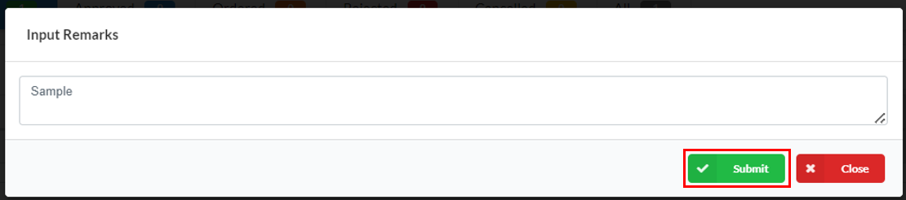

:::info

A message will be displayed indicating that the status of the Purchase Order has been **successfully updated.**

:::

### Step 4: Approving the Purchase Order

To approve a **Purchase Request**, follow these steps:

&nbsp;&nbsp;&nbsp;&nbsp;&nbsp;&nbsp;&nbsp;&nbsp;&nbsp;&nbsp;&nbsp;**➥** Locate the Purchase Order under the **`For Approval`** tab.

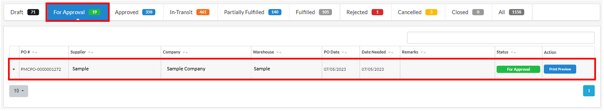

&nbsp;&nbsp;&nbsp;&nbsp;&nbsp;&nbsp;&nbsp;&nbsp;&nbsp;&nbsp;&nbsp;**➥** Click the **`Arrow`** button (down) to expand the Purchase Order and view its details.

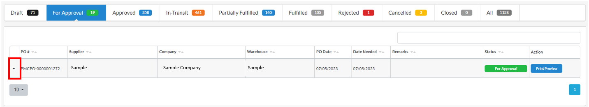

&nbsp;&nbsp;&nbsp;&nbsp;&nbsp;&nbsp;&nbsp;&nbsp;&nbsp;&nbsp;&nbsp;**➥** Review all the details of the Purchase Order, ensuring that the information is correct.

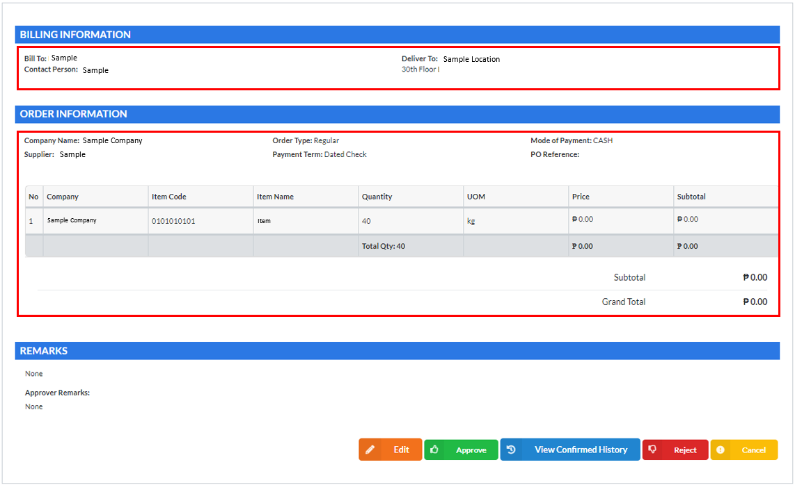

&nbsp;&nbsp;&nbsp;&nbsp;&nbsp;&nbsp;&nbsp;&nbsp;&nbsp;&nbsp;&nbsp;**➥** If all the information is correct, click the **`Approved`** button to proceed with the approval process.

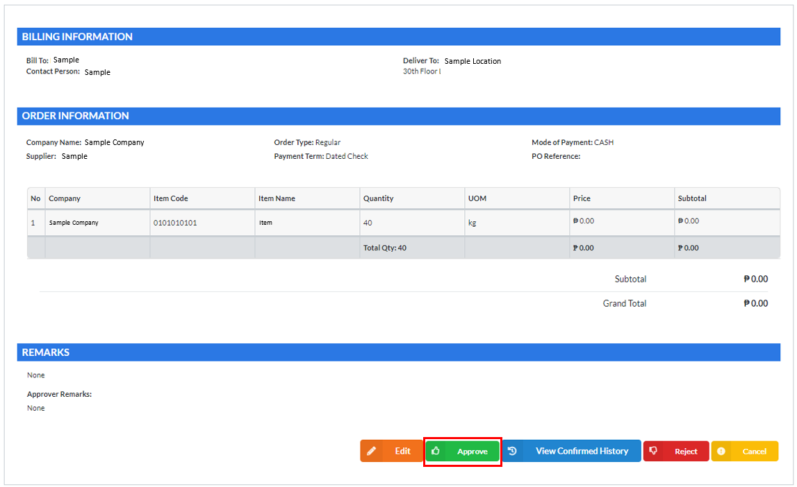

&nbsp;&nbsp;&nbsp;&nbsp;&nbsp;&nbsp;&nbsp;&nbsp;&nbsp;&nbsp;&nbsp;**➥** Provide any **Remarks** related to the Purchase Request in the designated field.

&nbsp;&nbsp;&nbsp;&nbsp;&nbsp;&nbsp;&nbsp;&nbsp;&nbsp;&nbsp;&nbsp;**➥** Click on **`Submit`** button.

:::info

A message will be displayed indicating that the status of the Purchase Request has been **successfully updated.**

:::

### Step 5: Shipping Advice

&nbsp;&nbsp;&nbsp;&nbsp;&nbsp;&nbsp;&nbsp;&nbsp;&nbsp;&nbsp;&nbsp;**➥** Locate the Purchase Order under the **`Approved`** tab.

&nbsp;&nbsp;&nbsp;&nbsp;&nbsp;&nbsp;&nbsp;&nbsp;&nbsp;&nbsp;&nbsp;**➥** Click the **`Arrow`** button (down) to expand the Purchase Order and view its details.

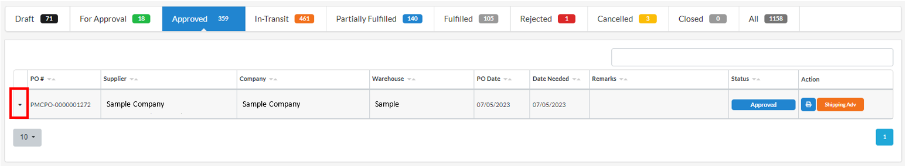

&nbsp;&nbsp;&nbsp;&nbsp;&nbsp;&nbsp;&nbsp;&nbsp;&nbsp;&nbsp;&nbsp;**➥** Review all the details of the Purchase Order, ensuring that the information is correct.

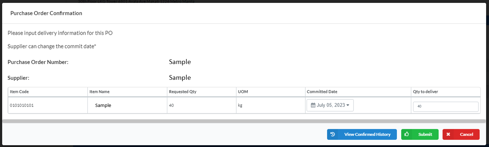

&nbsp;&nbsp;&nbsp;&nbsp;&nbsp;&nbsp;&nbsp;&nbsp;&nbsp;&nbsp;&nbsp;**➥** If all the information is correct, click the **`Shipping Adv`** button to proceed with the shipping process.

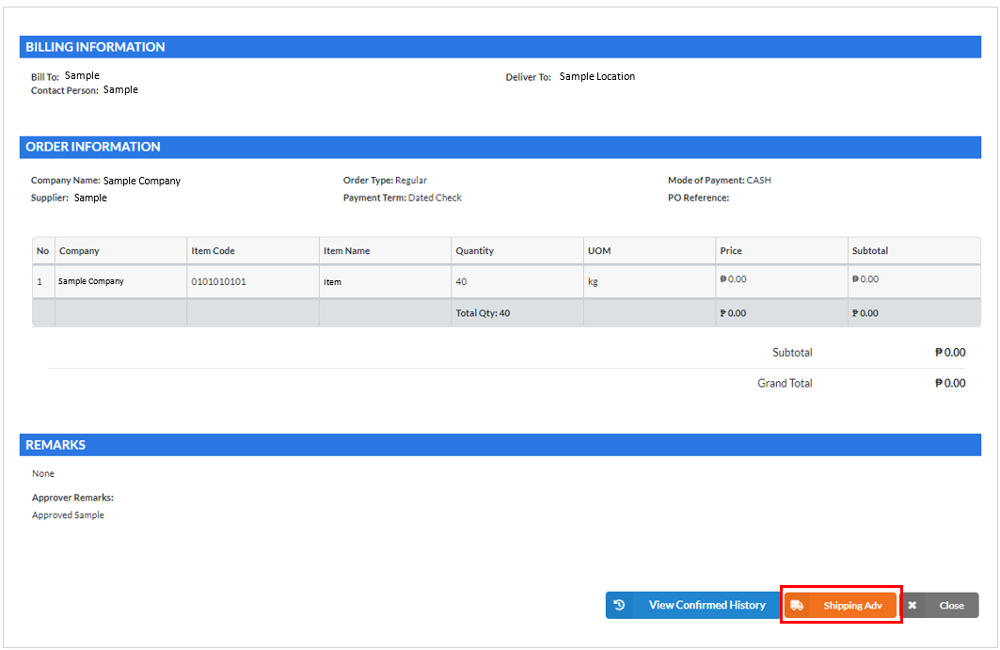

&nbsp;&nbsp;&nbsp;&nbsp;&nbsp;&nbsp;&nbsp;&nbsp;&nbsp;&nbsp;&nbsp;**➥** A modal will appear that consist of the details of the Purchase Order. Check it and input the **`Quantity`** to deliver.

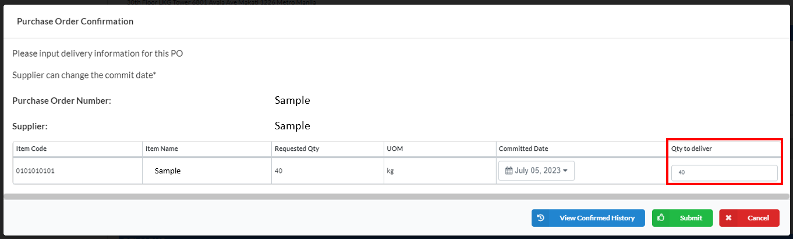

&nbsp;&nbsp;&nbsp;&nbsp;&nbsp;&nbsp;&nbsp;&nbsp;&nbsp;&nbsp;&nbsp;**➥** Click on **`Submit`** button to confirm the Purchase Order Confirmation.

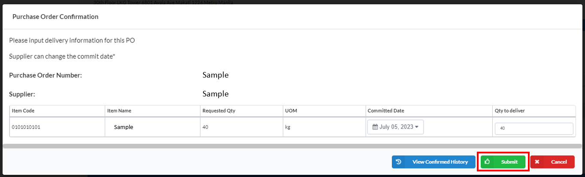

&nbsp;&nbsp;&nbsp;&nbsp;&nbsp;&nbsp;&nbsp;&nbsp;&nbsp;&nbsp;&nbsp;**➥** Provide any **Remarks** related to the Purchase Order.

&nbsp;&nbsp;&nbsp;&nbsp;&nbsp;&nbsp;&nbsp;&nbsp;&nbsp;&nbsp;&nbsp;**➥** Click on **`Submit`** button.

:::info

A message will be displayed indicating that the status of the Purchase Order has been **successfully updated.**

:::

:::tip SUCCESS

Congratulations! You have successfully approved and shipped a **Purchase Order**. 

:::