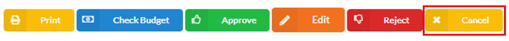

## Approving Purchase Request

### Overview

This section serves as a comprehensive guide on how to approve a Purchase Request. By following these step-by-step instructions, approvers will be able to navigate the approval process and review the purchase request details. 

### Step 1: Navigate to the Page

To navigate to the **Purchase Request Page**:

&nbsp;&nbsp;&nbsp;&nbsp;&nbsp;&nbsp;&nbsp;&nbsp;&nbsp;&nbsp;&nbsp;**➥** Click on the **`Purchasing`** dropdown button.

&nbsp;&nbsp;&nbsp;&nbsp;&nbsp;&nbsp;&nbsp;&nbsp;&nbsp;&nbsp;&nbsp;**➥** Select **`Purchase Request`**.

### Step 2: Search the Purchase Request

To search for a specific **Purchase Request**, follow these steps:

&nbsp;&nbsp;&nbsp;&nbsp;&nbsp;&nbsp;&nbsp;&nbsp;&nbsp;&nbsp;&nbsp;**➥** Input the **`PR Number`** or the **`Purchase Request Number`** in the designated field.

&nbsp;&nbsp;&nbsp;&nbsp;&nbsp;&nbsp;&nbsp;&nbsp;&nbsp;&nbsp;&nbsp;**➥** Input the **`Department`** associated with the purchase request.

&nbsp;&nbsp;&nbsp;&nbsp;&nbsp;&nbsp;&nbsp;&nbsp;&nbsp;&nbsp;&nbsp;**➥** Select the **`Start Date`** and the **`End Date`** to define the range of dates for the search.

&nbsp;&nbsp;&nbsp;&nbsp;&nbsp;&nbsp;&nbsp;&nbsp;&nbsp;&nbsp;&nbsp;**➥** Choose whether you want to search by **`PR Date`** or **`Date Needed`** using the provided options.

&nbsp;&nbsp;&nbsp;&nbsp;&nbsp;&nbsp;&nbsp;&nbsp;&nbsp;&nbsp;&nbsp;**➥** Click the **`Search`** button to filter the lists based on the specified criteria.

:::caution REMEMBER

Please ensure that the details you input here correspond to the information provided when adding the **Purchase Request**.

:::

### Step 3: Approving the Purchase Request

To approve a **Purchase Request**, follow these steps:

&nbsp;&nbsp;&nbsp;&nbsp;&nbsp;&nbsp;&nbsp;&nbsp;&nbsp;&nbsp;&nbsp;**➥** After filtering the lists, locate the Purchase Request under the **`For Approval`** tab.

&nbsp;&nbsp;&nbsp;&nbsp;&nbsp;&nbsp;&nbsp;&nbsp;&nbsp;&nbsp;&nbsp;**➥** Click the **`Arrow`** button (down) to expand the Purchase Request and view its details.

&nbsp;&nbsp;&nbsp;&nbsp;&nbsp;&nbsp;&nbsp;&nbsp;&nbsp;&nbsp;&nbsp;**➥** Review all the details of the Purchase Request, ensuring that the information is correct. The status should be displayed as **"For Approval."**

&nbsp;&nbsp;&nbsp;&nbsp;&nbsp;&nbsp;&nbsp;&nbsp;&nbsp;&nbsp;&nbsp;**➥** If all the information is correct, click the **`Approved`** button to proceed with the approval process.

&nbsp;&nbsp;&nbsp;&nbsp;&nbsp;&nbsp;&nbsp;&nbsp;&nbsp;&nbsp;&nbsp;**➥** Provide any **Remarks** related to the Purchase Request in the designated field.

&nbsp;&nbsp;&nbsp;&nbsp;&nbsp;&nbsp;&nbsp;&nbsp;&nbsp;&nbsp;&nbsp;**➥** Click on **`Submit`** button.

:::info

A message will be displayed indicating that the status of the Purchase Request has been **successfully updated.**

:::

:::info INFORMATION

Click on the **`Print`** button to **print** the Purchase Request.

Click on the **`Check Budget`** button to **check** the cost center name of the Purchase Request.

Click on the **`Approved`** button to **approved** the Purchase Request.

Click on the **`Edit`** button to **edit** the Purchase Request.

Click on the **`Reject`** button to **reject** the Purchase Request.

Click on the **`Cancel`** button to **cancel** the Purchase Request.

:::

:::tip SUCCESS

Congratulations! You have successfully approved a **Purchase Request**. 

:::

