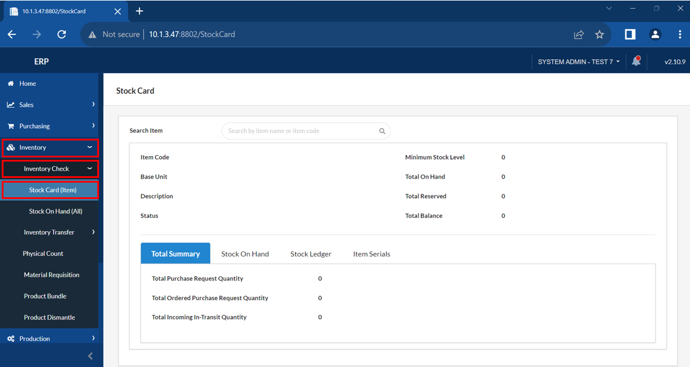
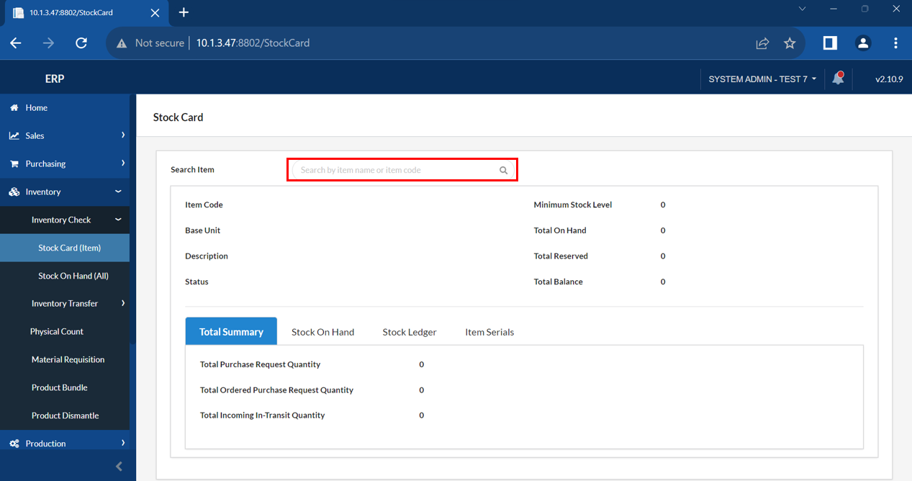
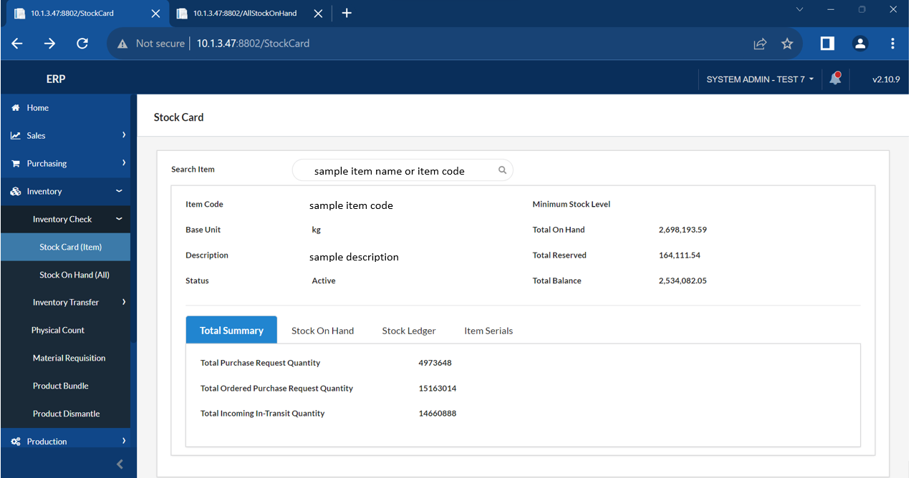
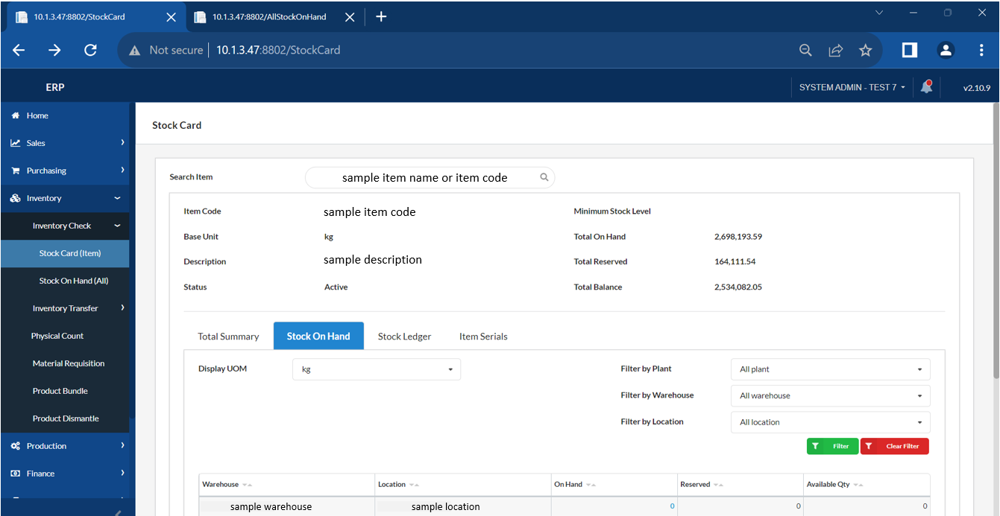
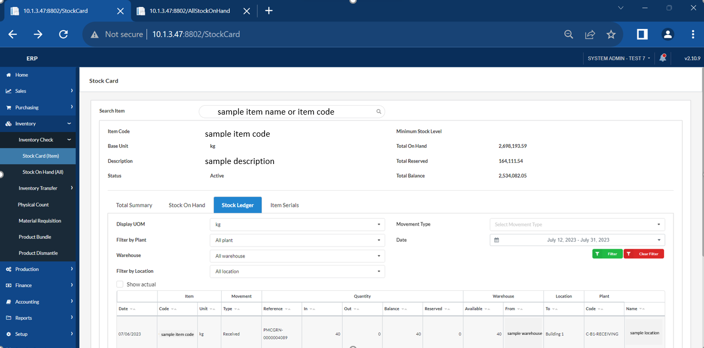

## Inventory Check - Stock Card (Item)

### Overview

This section will walk you through the process of inventory checking of stock card, which contains detailed information about a specific item's transactions.

### Step 1: Navigate to the Page

To navigate to the **Inventory Check - Stock Card (Item)**:

&nbsp;&nbsp;&nbsp;&nbsp;&nbsp;&nbsp;&nbsp;&nbsp;&nbsp;&nbsp;&nbsp;**➥** Click on the **`Inventory`** dropdown button.

&nbsp;&nbsp;&nbsp;&nbsp;&nbsp;&nbsp;&nbsp;&nbsp;&nbsp;&nbsp;&nbsp;**➥** Select **`Inventory Check`** dropdown button.

&nbsp;&nbsp;&nbsp;&nbsp;&nbsp;&nbsp;&nbsp;&nbsp;&nbsp;&nbsp;&nbsp;**➥** Select **`Stock Card (Item)`**.

### Step 2: Search an Item

&nbsp;&nbsp;&nbsp;&nbsp;&nbsp;&nbsp;&nbsp;&nbsp;&nbsp;&nbsp;&nbsp;**➥** Click on the **`Search bar`** and search an item using its **item name** or **item code**.

:::info

You can now check the quantity of inventory or stock of the specific item you have searched, whether on the Total Summary, Stock On Hand, or Stock Ledger tab.

:::

