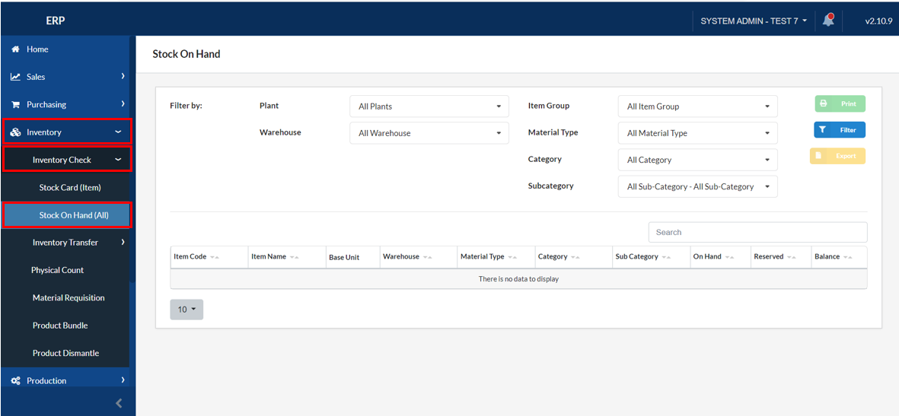
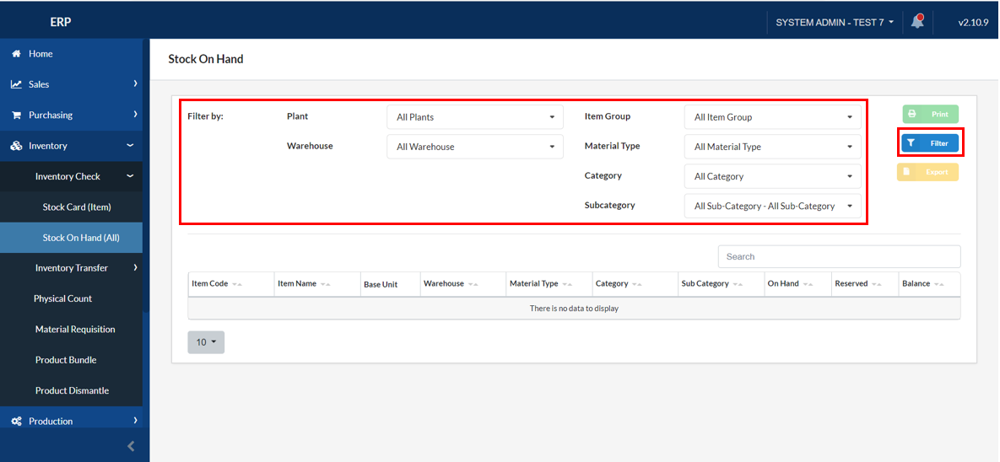
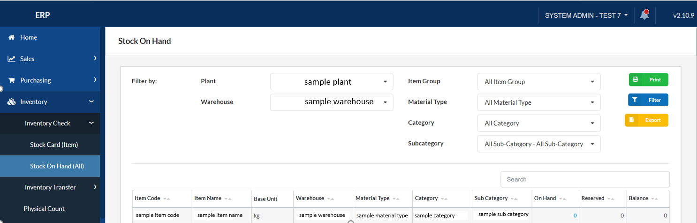

## Inventory Check - Stock On Hand (All)

### Overview

This section will walk you through the process of inventory checking of stock on hand, which contains detailed information about all the item's transactions.

### Step 1: Navigate to the Page

To navigate to the **Inventory Check - Stock On Hand (All)**:

&nbsp;&nbsp;&nbsp;&nbsp;&nbsp;&nbsp;&nbsp;&nbsp;&nbsp;&nbsp;&nbsp;**➥** Click on the **`Inventory`** dropdown button.

&nbsp;&nbsp;&nbsp;&nbsp;&nbsp;&nbsp;&nbsp;&nbsp;&nbsp;&nbsp;&nbsp;**➥** Select **`Inventory Check`** dropdown button.

&nbsp;&nbsp;&nbsp;&nbsp;&nbsp;&nbsp;&nbsp;&nbsp;&nbsp;&nbsp;&nbsp;**➥** Select **`Stock On Hand (All)`**.

### Step 2: Filter the Stock On Hand

Filter the items by their location (Plant & Warehouse), item group, material type, category, and subcategory.

&nbsp;&nbsp;&nbsp;&nbsp;&nbsp;&nbsp;&nbsp;&nbsp;&nbsp;&nbsp;&nbsp;**➥** Then click on the **`Filter`** button.

:::info

You can now check the quantity of inventory or stock of the items you have searched based on the filters you have used.

:::

