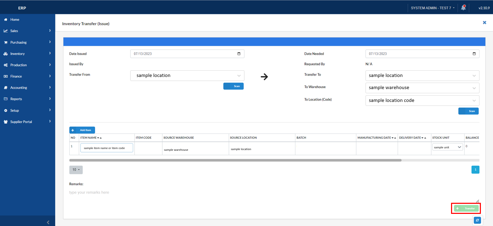

## Inventory Transfer - Creating Stock Issue

### Overview

This section will walk you through the process of creating a stock issue.

### Step 1: Navigate to the Page

To navigate to the **Inventory Transfer - Issue**:

&nbsp;&nbsp;&nbsp;&nbsp;&nbsp;&nbsp;&nbsp;&nbsp;&nbsp;&nbsp;&nbsp;**➥** Click on the **`Inventory`** dropdown button.

&nbsp;&nbsp;&nbsp;&nbsp;&nbsp;&nbsp;&nbsp;&nbsp;&nbsp;&nbsp;&nbsp;**➥** Select **`Inventory Transfer`** dropdown button.

&nbsp;&nbsp;&nbsp;&nbsp;&nbsp;&nbsp;&nbsp;&nbsp;&nbsp;&nbsp;&nbsp;**➥** Select **`Issue`**.

### Step 2: Create Stock Issue

To create a stock issue:

&nbsp;&nbsp;&nbsp;&nbsp;&nbsp;&nbsp;&nbsp;&nbsp;&nbsp;&nbsp;&nbsp;**➥** Click on the **`Create Stock Issue`** button.

### Step 3: Input the necessary information for Inventory Transfer (Issue)

### Step 4: Add Item/s
&nbsp;&nbsp;&nbsp;&nbsp;&nbsp;&nbsp;&nbsp;&nbsp;&nbsp;&nbsp;&nbsp;**➥** Click on the **`Add Item`** to choose the item/s you want to transfer.

### Step 5: Transfer the item/s you added
&nbsp;&nbsp;&nbsp;&nbsp;&nbsp;&nbsp;&nbsp;&nbsp;&nbsp;&nbsp;&nbsp;**➥** Click on the **`Transfer`** to button to submit your created stock issue.

### Step 6: Confirm the stock issue you created
&nbsp;&nbsp;&nbsp;&nbsp;&nbsp;&nbsp;&nbsp;&nbsp;&nbsp;&nbsp;&nbsp;**➥** It will prompt a confirmation message. Click on the **`Yes`** button to proceed.

:::info

The created stock issue will now appear on the "For Receiving" tab of the Issue List. To receive this, go to the **`Inventory Transfer - Receive Page`**.

**`Note:`** Take note of the Stock Transfer No. of your created stock issue.

:::
