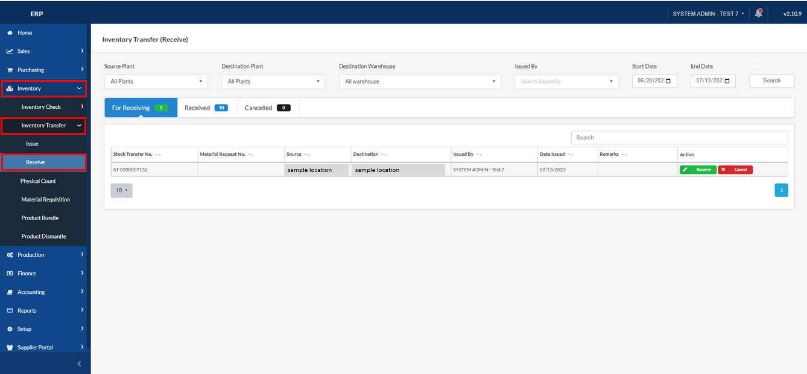
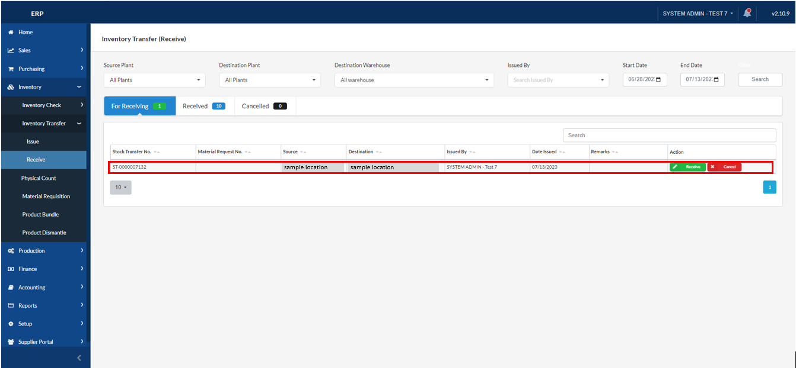
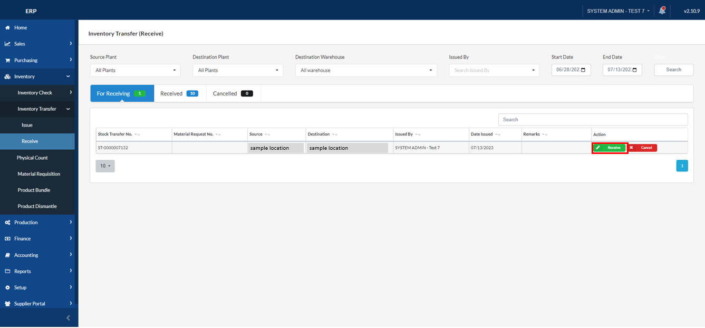
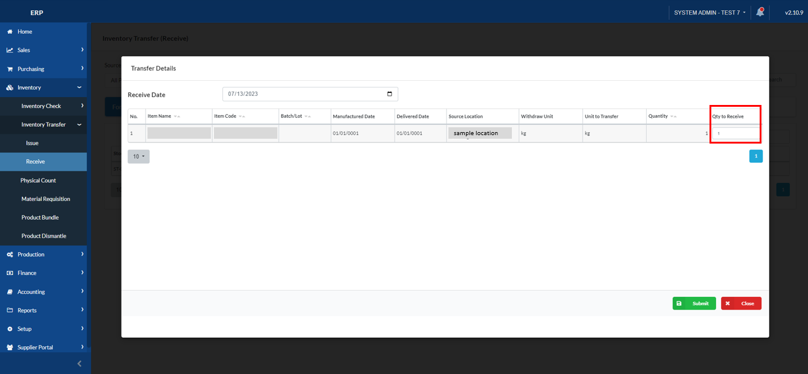
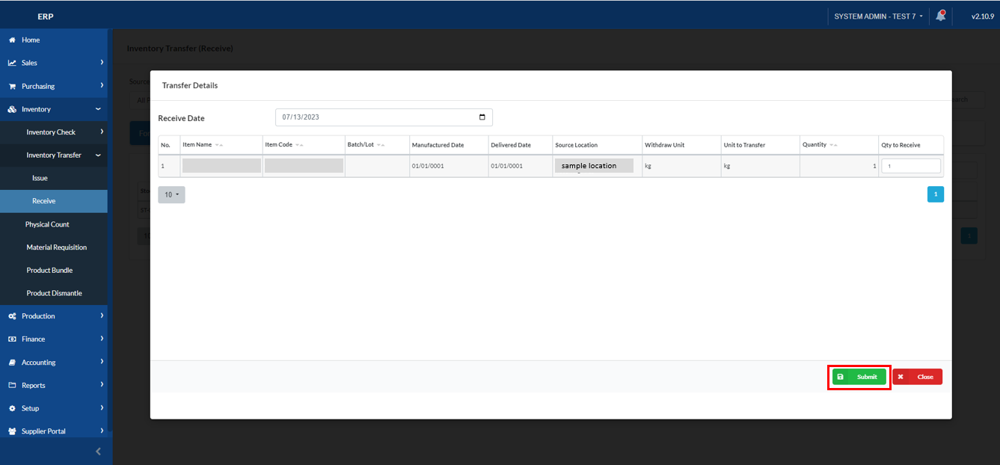
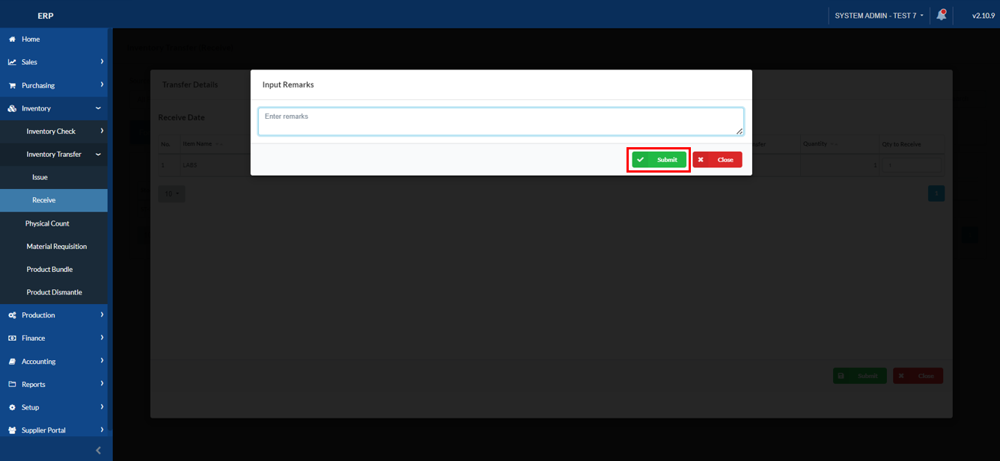
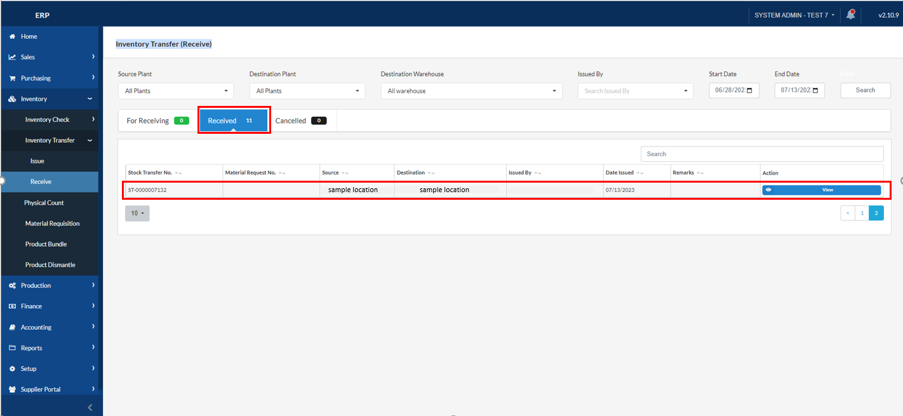

## Inventory Transfer - Receive

### Overview

This section will walk you through the process of receiving the created stock issue.

### Step 1: Navigate to the Page

To navigate to the **Inventory Transfer - Receive**:

&nbsp;&nbsp;&nbsp;&nbsp;&nbsp;&nbsp;&nbsp;&nbsp;&nbsp;&nbsp;&nbsp;**➥** Click on the **`Inventory`** dropdown button.

&nbsp;&nbsp;&nbsp;&nbsp;&nbsp;&nbsp;&nbsp;&nbsp;&nbsp;&nbsp;&nbsp;**➥** Select **`Inventory Transfer`** dropdown button.

&nbsp;&nbsp;&nbsp;&nbsp;&nbsp;&nbsp;&nbsp;&nbsp;&nbsp;&nbsp;&nbsp;**➥** Select **`Receive`**.

### Step 2: Receive the stock issue you have created

&nbsp;&nbsp;&nbsp;&nbsp;&nbsp;&nbsp;&nbsp;&nbsp;&nbsp;&nbsp;&nbsp;**➥** In the **`For Receiving tab`**, look for the stock issue you have created using the Stock Transfer No.

&nbsp;&nbsp;&nbsp;&nbsp;&nbsp;&nbsp;&nbsp;&nbsp;&nbsp;&nbsp;&nbsp;**➥** Click the **`Receive`** button under the Action column.

&nbsp;&nbsp;&nbsp;&nbsp;&nbsp;&nbsp;&nbsp;&nbsp;&nbsp;&nbsp;&nbsp;**➥**The Transfer Details will be prompted. Input the quantity you want to receive in the **`Qty to Receive column`**.

&nbsp;&nbsp;&nbsp;&nbsp;&nbsp;&nbsp;&nbsp;&nbsp;&nbsp;&nbsp;&nbsp;**➥** Click the **`Submit`** button to proceed.

&nbsp;&nbsp;&nbsp;&nbsp;&nbsp;&nbsp;&nbsp;&nbsp;&nbsp;&nbsp;&nbsp;**➥** Put some remarks, if you have, then click the **`Submit`** button to proceed.

Now, the Stock Transfer Issue status was tagged as Received. 

:::info

The received stock issue will now appear on the "Received" tab of the Inventory Transfer (Receive) page.

:::

