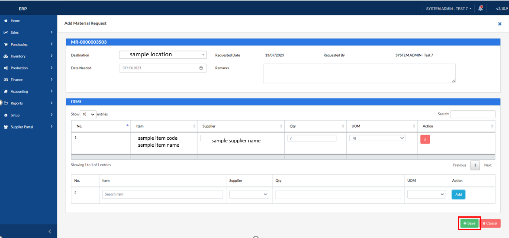

## Material Requisition

### Overview

This section will walk you through the process of requesting materials/items.

### Step 1: Navigate to the Page

To navigate to the **Material Requisition**:

&nbsp;&nbsp;&nbsp;&nbsp;&nbsp;&nbsp;&nbsp;&nbsp;&nbsp;&nbsp;&nbsp;**➥** Click on the **`Inventory`** dropdown button.

&nbsp;&nbsp;&nbsp;&nbsp;&nbsp;&nbsp;&nbsp;&nbsp;&nbsp;&nbsp;&nbsp;**➥** Select **`Material Requisition`**

### Step 2: Add new material request

&nbsp;&nbsp;&nbsp;&nbsp;&nbsp;&nbsp;&nbsp;&nbsp;&nbsp;&nbsp;&nbsp;**➥** Click on the **`New Material Request`** button.

### Step 3: Input the necessary information for your Material Request

### Step 4: Add Item/s

&nbsp;&nbsp;&nbsp;&nbsp;&nbsp;&nbsp;&nbsp;&nbsp;&nbsp;&nbsp;&nbsp;**➥** Search for the item you are requesting by **item name** or **item code**.

&nbsp;&nbsp;&nbsp;&nbsp;&nbsp;&nbsp;&nbsp;&nbsp;&nbsp;&nbsp;&nbsp;**➥** Input the quantity of the item you are requesting and then click on the **`Add`** button to add it to the ITEMS List above.

&nbsp;&nbsp;&nbsp;&nbsp;&nbsp;&nbsp;&nbsp;&nbsp;&nbsp;&nbsp;&nbsp;**➥** Click on the **`Save`** button to proceed.

&nbsp;&nbsp;&nbsp;&nbsp;&nbsp;&nbsp;&nbsp;&nbsp;&nbsp;&nbsp;&nbsp;**➥** After it reloads, click on the **`Submit`** button to submit your material request for approval.
 

:::info

The material request will now appear on the "For Approval" tab of the Material Request List.

:::

### Step 3: Approve the Material Request

&nbsp;&nbsp;&nbsp;&nbsp;&nbsp;&nbsp;&nbsp;&nbsp;&nbsp;&nbsp;&nbsp;**➥** Click on the **`+`** icon button to see the material request details.

&nbsp;&nbsp;&nbsp;&nbsp;&nbsp;&nbsp;&nbsp;&nbsp;&nbsp;&nbsp;&nbsp;**➥** Click on the **`Approve`** button.

&nbsp;&nbsp;&nbsp;&nbsp;&nbsp;&nbsp;&nbsp;&nbsp;&nbsp;&nbsp;&nbsp;**➥** A modal for input remarks will appear. 

&nbsp;&nbsp;&nbsp;&nbsp;&nbsp;&nbsp;&nbsp;&nbsp;&nbsp;&nbsp;&nbsp;**➥** Click on the **`Submit`** button to proceed.

:::info

The material request will now appear on the "Approved" tab of the Material Request List.

:::

### Step 4: Create an Issue for your approved Material Request

&nbsp;&nbsp;&nbsp;&nbsp;&nbsp;&nbsp;&nbsp;&nbsp;&nbsp;&nbsp;&nbsp;**➥** Click on the **`+`** icon button to see the approved material request details.

&nbsp;&nbsp;&nbsp;&nbsp;&nbsp;&nbsp;&nbsp;&nbsp;&nbsp;&nbsp;&nbsp;**➥** Click on the **`Create Issue`** button to create an issue.

It will then redirect you to **Inventory Transfer (Issue)** page.

&nbsp;&nbsp;&nbsp;&nbsp;&nbsp;&nbsp;&nbsp;&nbsp;&nbsp;&nbsp;&nbsp;**➥** You can edit some of the details of your issue for material request or even add item to your material request. 

&nbsp;&nbsp;&nbsp;&nbsp;&nbsp;&nbsp;&nbsp;&nbsp;&nbsp;&nbsp;&nbsp;**➥** If you're done, click on the **`Transfer`** button.

:::info

The created issue from material request will now appear on the "Issued" tab of the Material Request List.
To receive this, go to the **`Inventory Transfer - Receive Page`**.

**`Note:`** Take note of the Material Request No.
:::

### Step 5: Receive the created Issue for your approved Material Request

&nbsp;&nbsp;&nbsp;&nbsp;&nbsp;&nbsp;&nbsp;&nbsp;&nbsp;&nbsp;&nbsp;**➥** Click on the **`Receive`** button.

&nbsp;&nbsp;&nbsp;&nbsp;&nbsp;&nbsp;&nbsp;&nbsp;&nbsp;&nbsp;&nbsp;**➥** Input the **quantity to be received**.

&nbsp;&nbsp;&nbsp;&nbsp;&nbsp;&nbsp;&nbsp;&nbsp;&nbsp;&nbsp;&nbsp;**➥** Click on the **`Submit`** button.

:::info

The created issue from material request will now appear on the "Received" tab of the **Inventory Transfer - Receive page**.

:::

