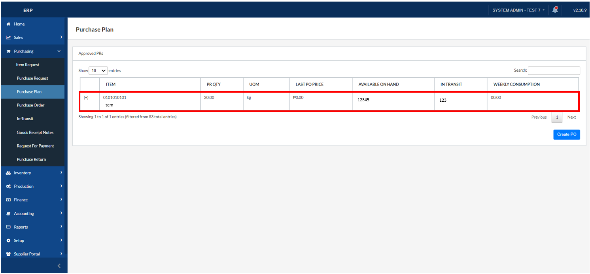
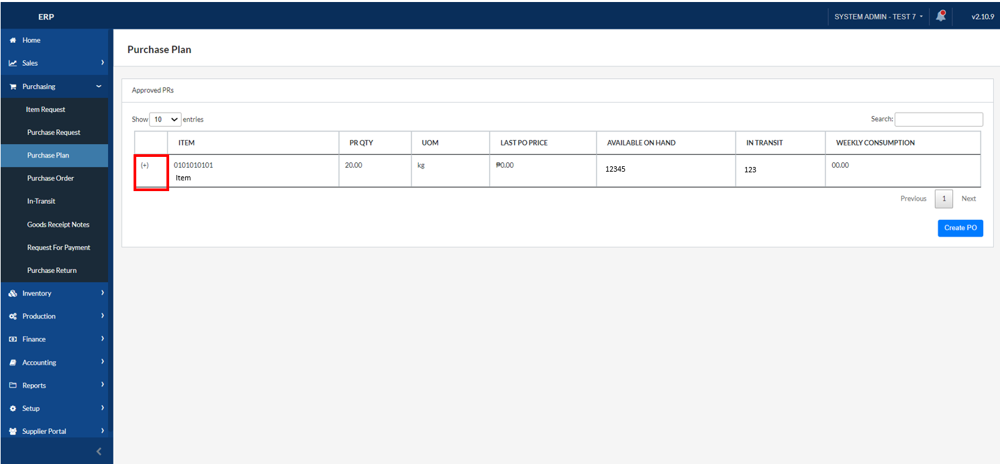
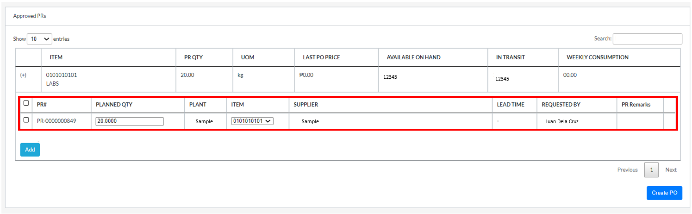
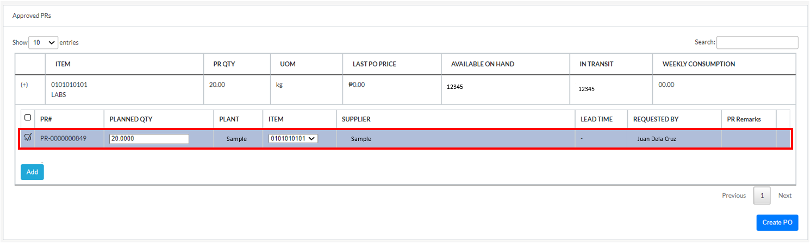
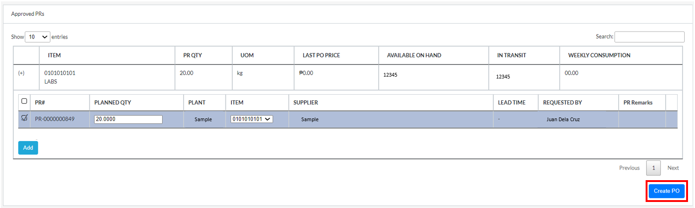

## Create a Purchase Order

### Overview

This section serves as a comprehensive guide on how to create a purchase order. By following these step-by-step instructions, users will be able to navigate the purchase order creation process.

### Step 1: Navigate to the Page

To navigate to the **Purchase Plan Page**:

&nbsp;&nbsp;&nbsp;&nbsp;&nbsp;&nbsp;&nbsp;&nbsp;&nbsp;&nbsp;&nbsp;**➥** Click on the **`Purchasing`** dropdown button.

&nbsp;&nbsp;&nbsp;&nbsp;&nbsp;&nbsp;&nbsp;&nbsp;&nbsp;&nbsp;&nbsp;**➥** Select **`Purchase Plan`**.

### Step 2: Selecting item and Creating a Purchase Order

&nbsp;&nbsp;&nbsp;&nbsp;&nbsp;&nbsp;&nbsp;&nbsp;&nbsp;&nbsp;&nbsp;**➥** Locate the **`item`** that you requested.

&nbsp;&nbsp;&nbsp;&nbsp;&nbsp;&nbsp;&nbsp;&nbsp;&nbsp;&nbsp;&nbsp;**➥** Click on the **`(+) Plus`** button to expand the details. 

&nbsp;&nbsp;&nbsp;&nbsp;&nbsp;&nbsp;&nbsp;&nbsp;&nbsp;&nbsp;&nbsp;**➥** Verify that the **`Details`** are correct. 

&nbsp;&nbsp;&nbsp;&nbsp;&nbsp;&nbsp;&nbsp;&nbsp;&nbsp;&nbsp;&nbsp;**➥** Put a **`Check`** mark to select the Purchase Request. 

&nbsp;&nbsp;&nbsp;&nbsp;&nbsp;&nbsp;&nbsp;&nbsp;&nbsp;&nbsp;&nbsp;**➥** Click on the **`Create PO`** button to create a **Purchase Order**.

:::tip SUCCESS

Congratulations! You have successfully created a **Purchase Order**. 

:::

