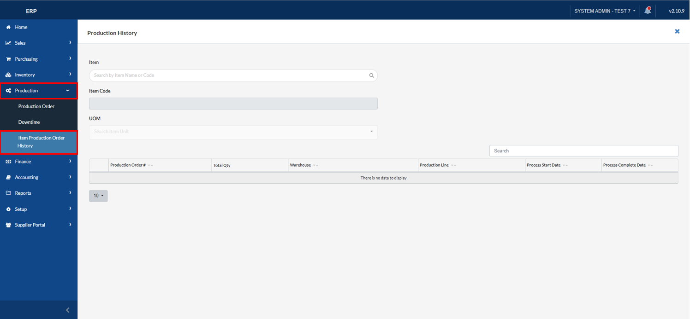
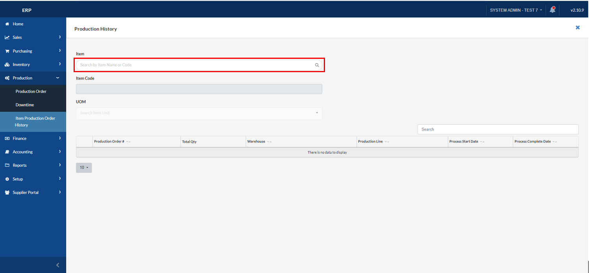
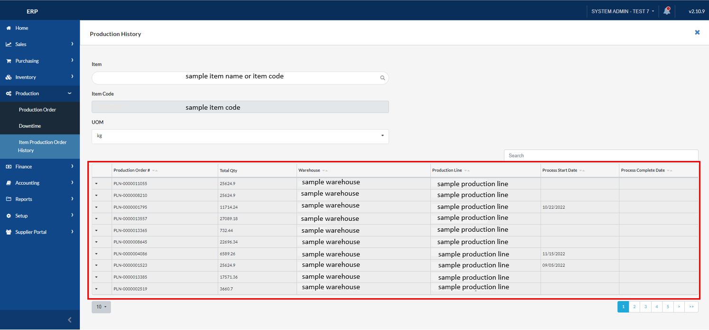

## Item Production Order History

### Overview

This section will walk you through the process of looking up to the Production History of a specific item.

### Step 1: Navigate to the Page

To navigate to the **Item Production Order History Page**:

&nbsp;&nbsp;&nbsp;&nbsp;&nbsp;&nbsp;&nbsp;&nbsp;&nbsp;&nbsp;&nbsp;**➥** Click on the **`Production`** dropdown button.

&nbsp;&nbsp;&nbsp;&nbsp;&nbsp;&nbsp;&nbsp;&nbsp;&nbsp;&nbsp;&nbsp;**➥** Select **`Item Production Order History`**.

### Step 2: Search an item by its item name or its item code

&nbsp;&nbsp;&nbsp;&nbsp;&nbsp;&nbsp;&nbsp;&nbsp;&nbsp;&nbsp;&nbsp;**➥** Input the **item name or item code**.

:::info

The production order history of the item you have searched will now be displayed.

:::

