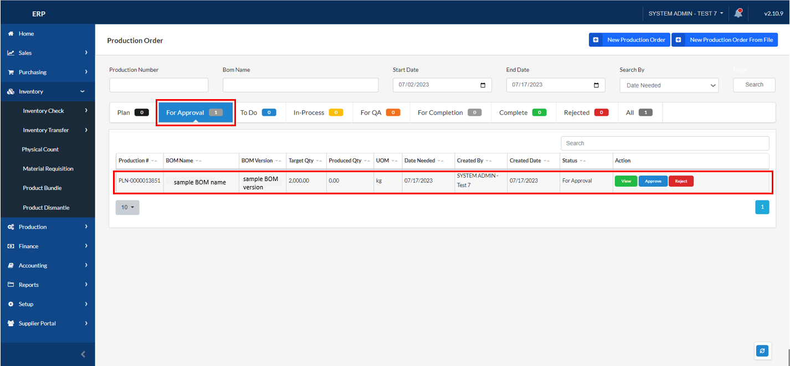

## Production Order

### Overview

This section will walk you through the process of creating a production order.

### Step 1: Navigate to the Page

To navigate to the **Production Order Page**:

&nbsp;&nbsp;&nbsp;&nbsp;&nbsp;&nbsp;&nbsp;&nbsp;&nbsp;&nbsp;&nbsp;**➥** Click on the **`Production`** dropdown button.

&nbsp;&nbsp;&nbsp;&nbsp;&nbsp;&nbsp;&nbsp;&nbsp;&nbsp;&nbsp;&nbsp;**➥** Select **`Production Order`**.

### Step 2: Create new Production Order

&nbsp;&nbsp;&nbsp;&nbsp;&nbsp;&nbsp;&nbsp;&nbsp;&nbsp;&nbsp;&nbsp;**➥** Click on the **`New Production Order`** button.

### Step 3: Input necessary information for your Production Order

After you have searched a BOM, all the information about it will appear including the item ingredients. 

You can now change the **Production Line**

&nbsp;&nbsp;&nbsp;&nbsp;&nbsp;&nbsp;&nbsp;&nbsp;&nbsp;&nbsp;&nbsp;**➥** Click on the **`search-plus`** icon.

&nbsp;&nbsp;&nbsp;&nbsp;&nbsp;&nbsp;&nbsp;&nbsp;&nbsp;&nbsp;&nbsp;**➥** Select a  new **Production Line**.

&nbsp;&nbsp;&nbsp;&nbsp;&nbsp;&nbsp;&nbsp;&nbsp;&nbsp;&nbsp;&nbsp;**➥** Then click on the **`Confirm`** button to proceed.

You can also input your preferred **Target Quantity** and **Add Batch** if you want to make this Production Order by batch.

&nbsp;&nbsp;&nbsp;&nbsp;&nbsp;&nbsp;&nbsp;&nbsp;&nbsp;&nbsp;&nbsp;**➥** Click on the **`Submit`** button to submit your Production Order.

:::info

The production order you just made will now appear on the "For Approval" tab of the Product Order List.

:::

### Step 4: Approve the production order

&nbsp;&nbsp;&nbsp;&nbsp;&nbsp;&nbsp;&nbsp;&nbsp;&nbsp;&nbsp;&nbsp;**➥** Click on the **`Approve`** button.

Then a modal for input remarks will appear. After leaving some remarks, click on the **`Submit`** button.

:::info

The approved production order will now appear on the "To Do" tab of the Product Order List.

:::
