## Receiving Delivery

### Overview

This section provides a step-by-step guide on how to receive a delivery. By following these instructions, you will be able to navigate the process of receiving the delivery, completing quality assurance (QA) tests, and marking the delivery as received.

### Step 1: Navigate to the Page

To navigate to the **Good Receipt Notes**:

&nbsp;&nbsp;&nbsp;&nbsp;&nbsp;&nbsp;&nbsp;&nbsp;&nbsp;&nbsp;&nbsp;**➥** Click on the **`Purchasing`** dropdown button.

&nbsp;&nbsp;&nbsp;&nbsp;&nbsp;&nbsp;&nbsp;&nbsp;&nbsp;&nbsp;&nbsp;**➥** Select **`Good Receipt Notes`**.

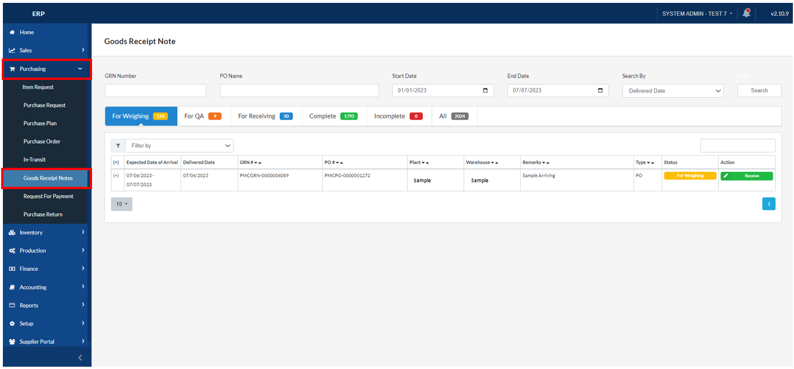

### Step 2: Locating the Delivery to Receive

&nbsp;&nbsp;&nbsp;&nbsp;&nbsp;&nbsp;&nbsp;&nbsp;&nbsp;&nbsp;&nbsp;**➥** After the delivery has arrived, you can search for the order by inputting the GRN Number or locate the delivery that you created. It is usually displayed at the top as the latest transaction or under the **"For Weighing"** tab.

&nbsp;&nbsp;&nbsp;&nbsp;&nbsp;&nbsp;&nbsp;&nbsp;&nbsp;&nbsp;&nbsp;**➥** Click on the **`Plus (+)`** button (down) to expand the Order details. 

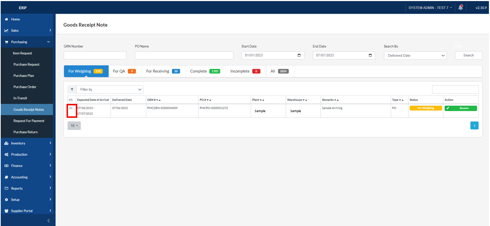

### Step 3: Receive Delivery

&nbsp;&nbsp;&nbsp;&nbsp;&nbsp;&nbsp;&nbsp;&nbsp;&nbsp;&nbsp;&nbsp;**➥** Verify that the **`Details`** are correct. Click on the **`Receive`** button. 

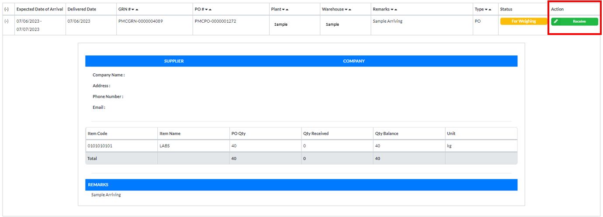

&nbsp;&nbsp;&nbsp;&nbsp;&nbsp;&nbsp;&nbsp;&nbsp;&nbsp;&nbsp;&nbsp;**➥** You will be directed to the next page. Input the following details.

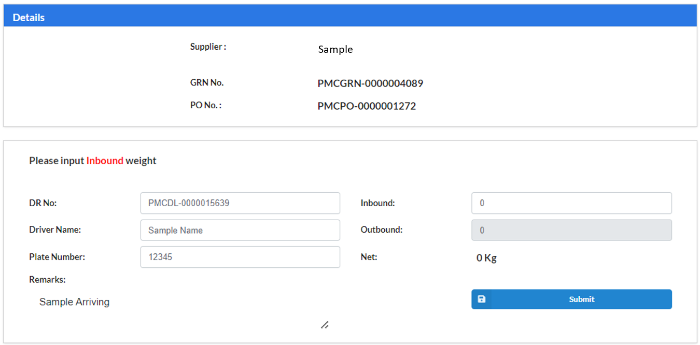

&nbsp;&nbsp;&nbsp;&nbsp;&nbsp;&nbsp;&nbsp;&nbsp;&nbsp;&nbsp;&nbsp;**➥** Input the **`Delivery Number`**.

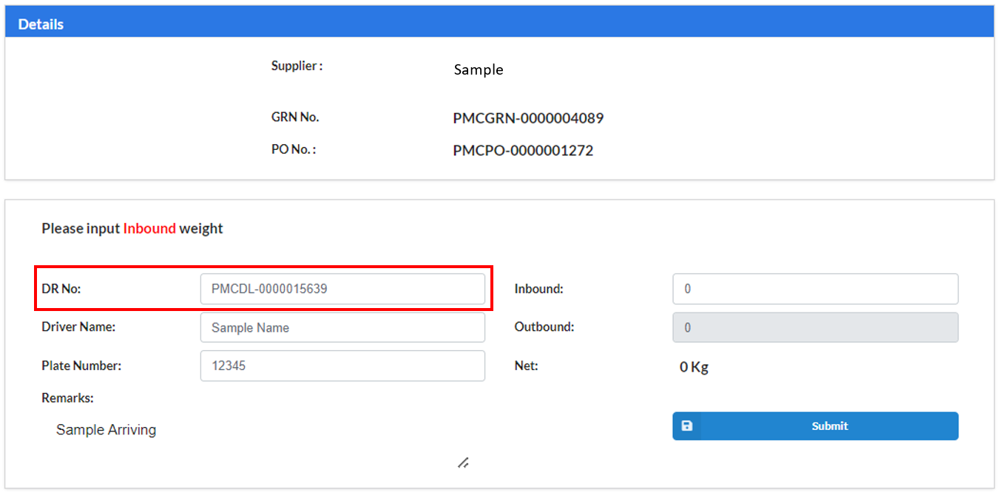

&nbsp;&nbsp;&nbsp;&nbsp;&nbsp;&nbsp;&nbsp;&nbsp;&nbsp;&nbsp;&nbsp;**➥** Input the **`Driver Name`**.

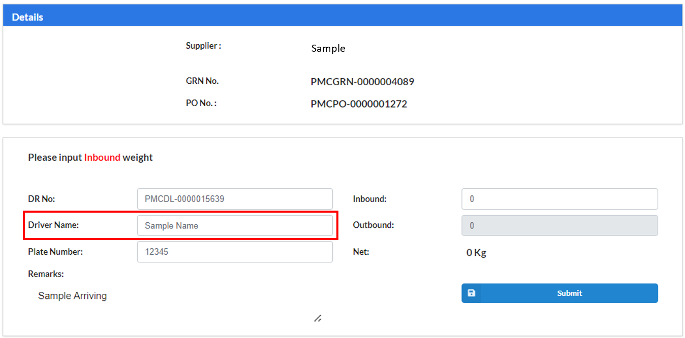

&nbsp;&nbsp;&nbsp;&nbsp;&nbsp;&nbsp;&nbsp;&nbsp;&nbsp;&nbsp;&nbsp;**➥** Input the **`Plate Number`**.

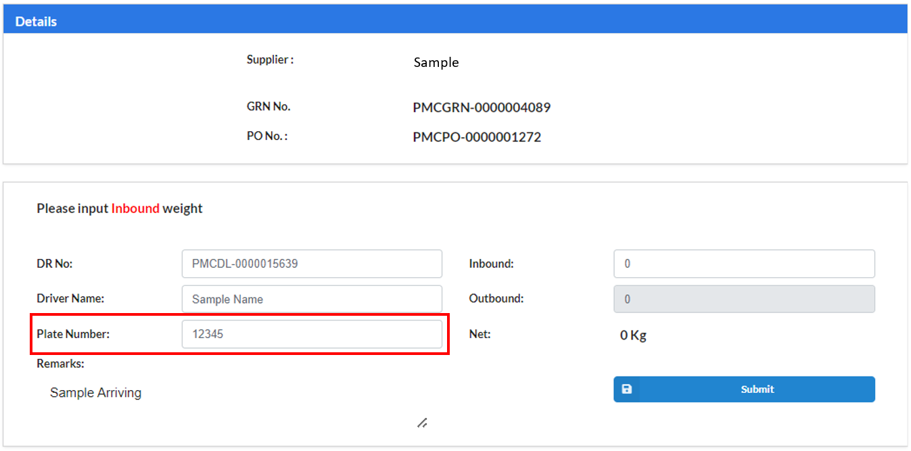

&nbsp;&nbsp;&nbsp;&nbsp;&nbsp;&nbsp;&nbsp;&nbsp;&nbsp;&nbsp;&nbsp;**➥** Input the **`Inbound`** weight of the vehicle.

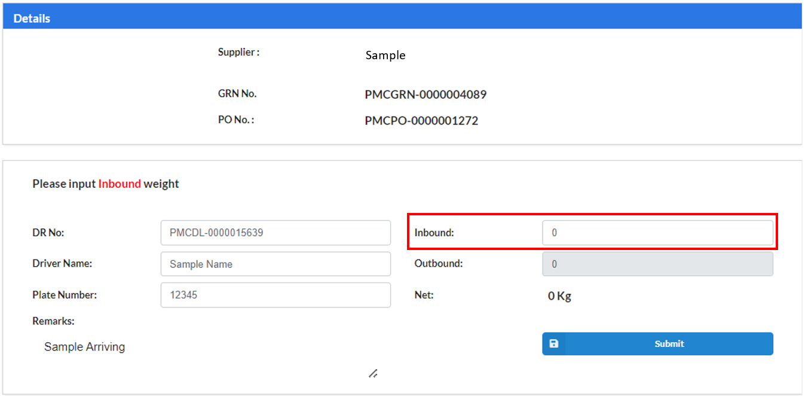

&nbsp;&nbsp;&nbsp;&nbsp;&nbsp;&nbsp;&nbsp;&nbsp;&nbsp;&nbsp;&nbsp;**➥** Click the **`Submit`** button.

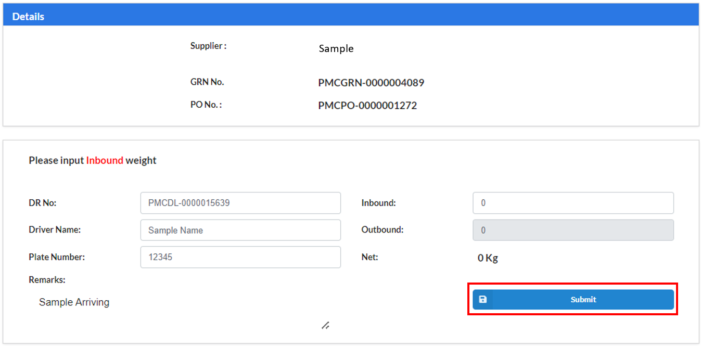

&nbsp;&nbsp;&nbsp;&nbsp;&nbsp;&nbsp;&nbsp;&nbsp;&nbsp;&nbsp;&nbsp;**➥** A confimation will appear. Click the **`Yes`** button to confirm.

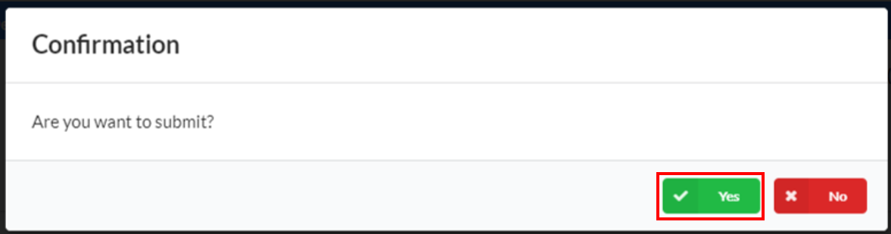

:::info

A message will be displayed indicating that the process has been saved **successfully** and can now proceed to **QA**.

Click the **`button`** to proceed to the next step.

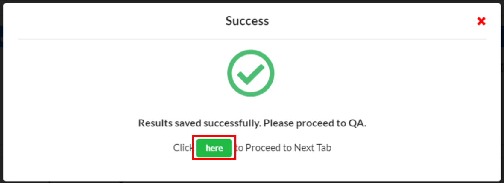

:::

### Step 4: QA Testing

&nbsp;&nbsp;&nbsp;&nbsp;&nbsp;&nbsp;&nbsp;&nbsp;&nbsp;&nbsp;&nbsp;**➥** After clicking the button, you will be directed to another page for **QA**. Complete the **QA test** before proceeding to the next step.next step.

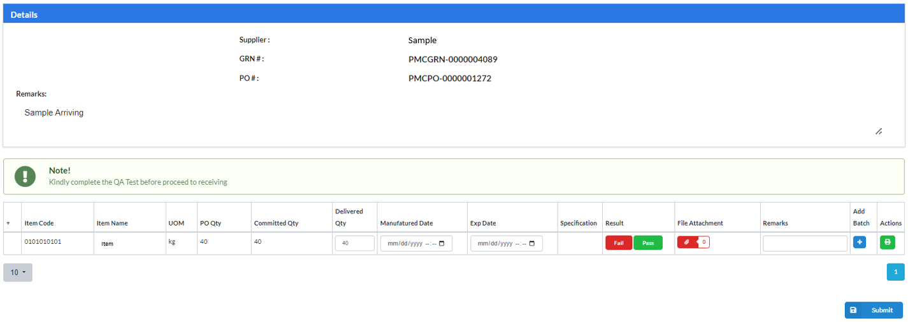

&nbsp;&nbsp;&nbsp;&nbsp;&nbsp;&nbsp;&nbsp;&nbsp;&nbsp;&nbsp;&nbsp;**➥** Check the details. For the Result, click **`Pass`** if the delivery **passed** the test, or click **`Fail`** if it **failed** the quality test.

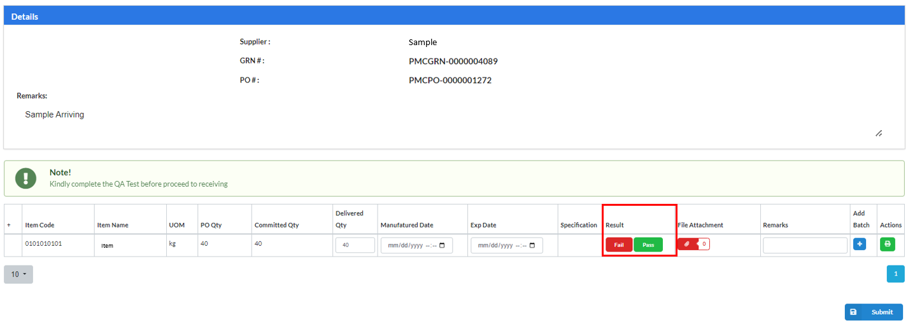

&nbsp;&nbsp;&nbsp;&nbsp;&nbsp;&nbsp;&nbsp;&nbsp;&nbsp;&nbsp;&nbsp;**➥** Input any **`Remark`**.

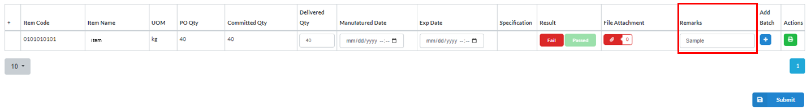

&nbsp;&nbsp;&nbsp;&nbsp;&nbsp;&nbsp;&nbsp;&nbsp;&nbsp;&nbsp;&nbsp;**➥** Click on the **`Submit`** button.

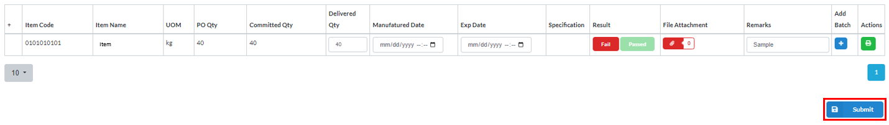

&nbsp;&nbsp;&nbsp;&nbsp;&nbsp;&nbsp;&nbsp;&nbsp;&nbsp;&nbsp;&nbsp;**➥** A confirmation will appear. Click on the **`Yes`** button.

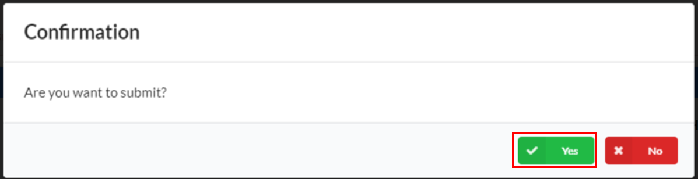

:::info

A message will be displayed indicating that the result has been saved **successfully**.

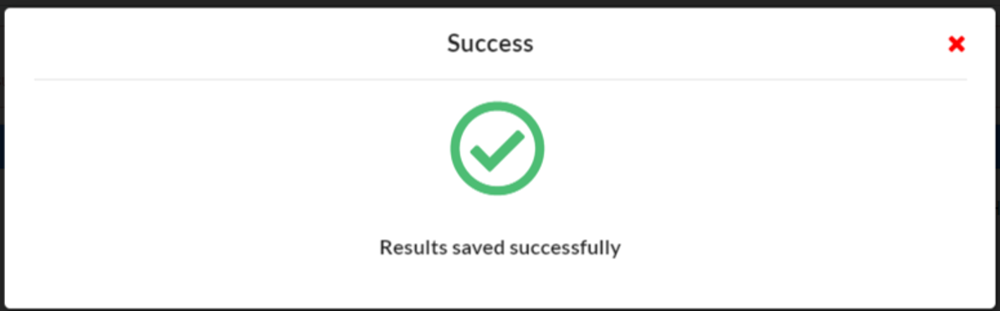

:::

### Step 5: Receiving in GRN

&nbsp;&nbsp;&nbsp;&nbsp;&nbsp;&nbsp;&nbsp;&nbsp;&nbsp;&nbsp;&nbsp;**➥** Locate the GRN under the **`For Receiving`** tab.

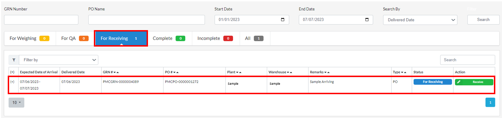

&nbsp;&nbsp;&nbsp;&nbsp;&nbsp;&nbsp;&nbsp;&nbsp;&nbsp;&nbsp;&nbsp;**➥** Click the **`Plus (+)`** button (down) to expand the view its details.

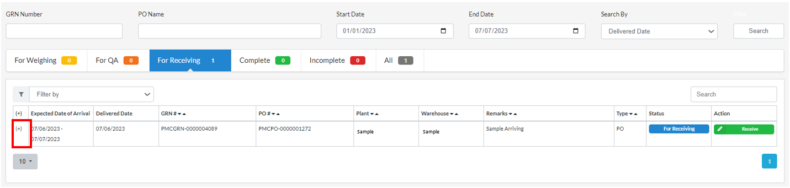

&nbsp;&nbsp;&nbsp;&nbsp;&nbsp;&nbsp;&nbsp;&nbsp;&nbsp;&nbsp;&nbsp;**➥** Review all the details. If all the information is correct, click the **`Receive`** button to proceed with the next process.

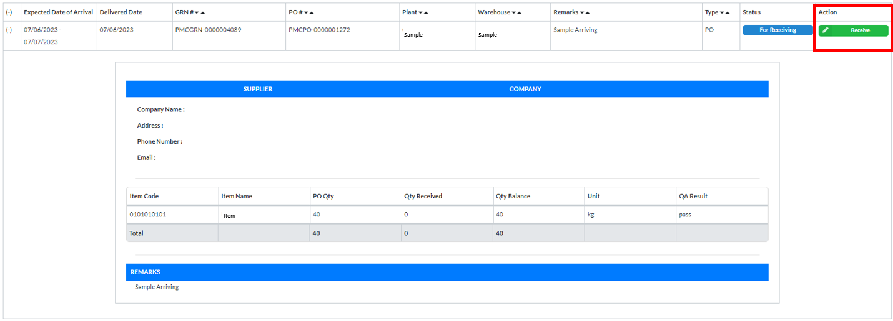

&nbsp;&nbsp;&nbsp;&nbsp;&nbsp;&nbsp;&nbsp;&nbsp;&nbsp;&nbsp;&nbsp;**➥** You will be directed to the next page.

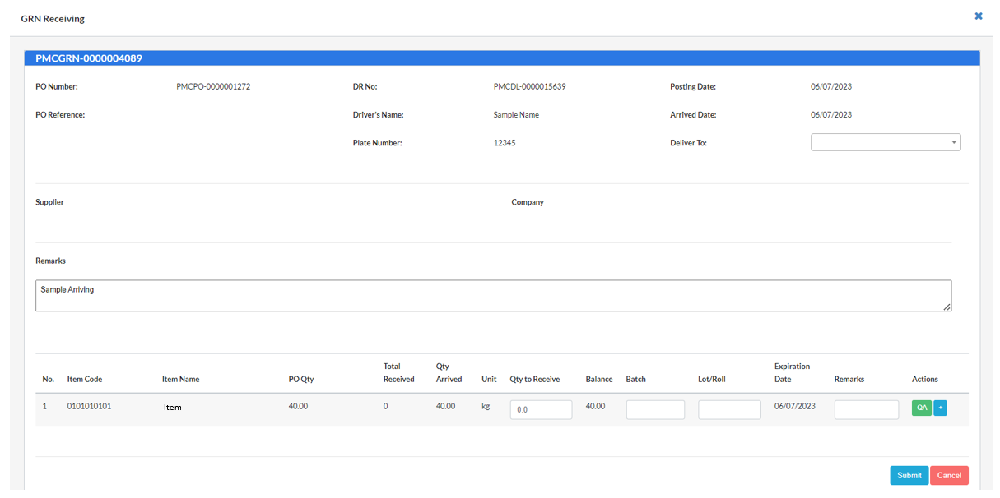

### Step 6: Completing the Receiving Process

&nbsp;&nbsp;&nbsp;&nbsp;&nbsp;&nbsp;&nbsp;&nbsp;&nbsp;&nbsp;&nbsp;**➥** Input the **`Quantity`** to receive.

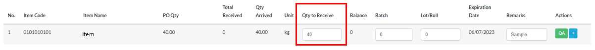

&nbsp;&nbsp;&nbsp;&nbsp;&nbsp;&nbsp;&nbsp;&nbsp;&nbsp;&nbsp;&nbsp;**➥** Input the **`Batch`**. 

  
Batch

  

    
A batch is a group or collection of products or materials that are processed, manufactured, or purchased together.

     
  

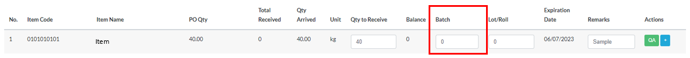

&nbsp;&nbsp;&nbsp;&nbsp;&nbsp;&nbsp;&nbsp;&nbsp;&nbsp;&nbsp;&nbsp;**➥** Input the **`Lot`**.

  
Lot

  

    
A lot is similar to a batch and refers to a specific quantity of products or materials that are produced or purchased together as a unit. 

     
  

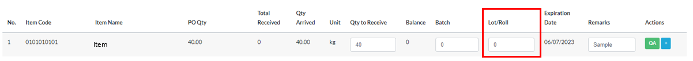

&nbsp;&nbsp;&nbsp;&nbsp;&nbsp;&nbsp;&nbsp;&nbsp;&nbsp;&nbsp;&nbsp;**➥** Input any **`Remark`**.

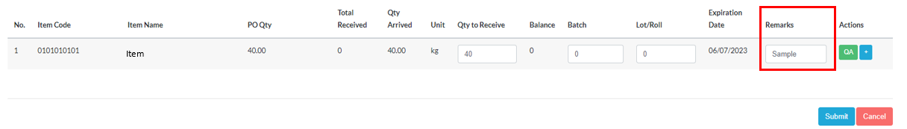

&nbsp;&nbsp;&nbsp;&nbsp;&nbsp;&nbsp;&nbsp;&nbsp;&nbsp;&nbsp;&nbsp;**➥** Click on the **`Submit`** button.

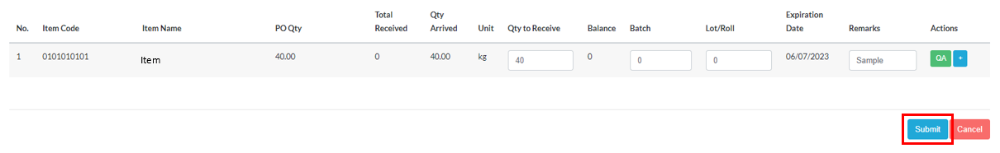

:::info

A message will be displayed indicating that you have **successfully.** received item.

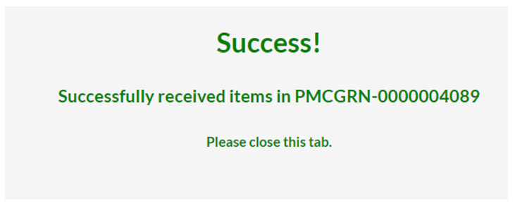

:::

&nbsp;&nbsp;&nbsp;&nbsp;&nbsp;&nbsp;&nbsp;&nbsp;&nbsp;&nbsp;&nbsp;**➥** You can now view the received item/delivery under the **"Complete"** tab.

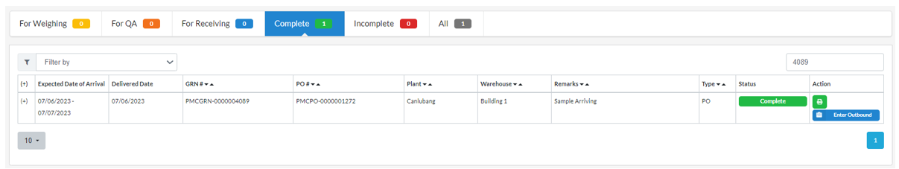

:::tip SUCCESS

Congratulations! You have **successfully** received a delivery.

:::